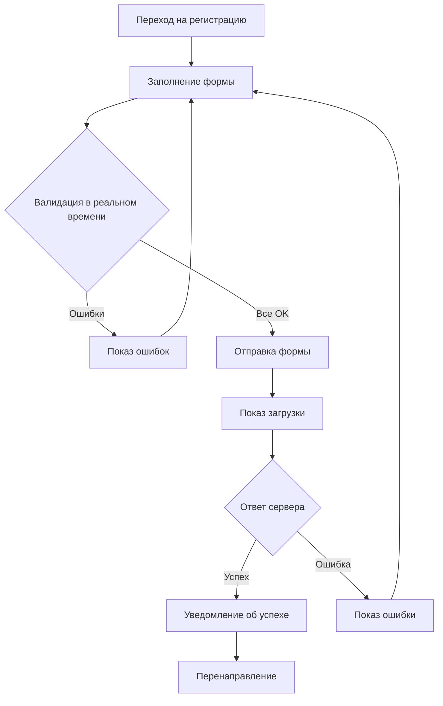
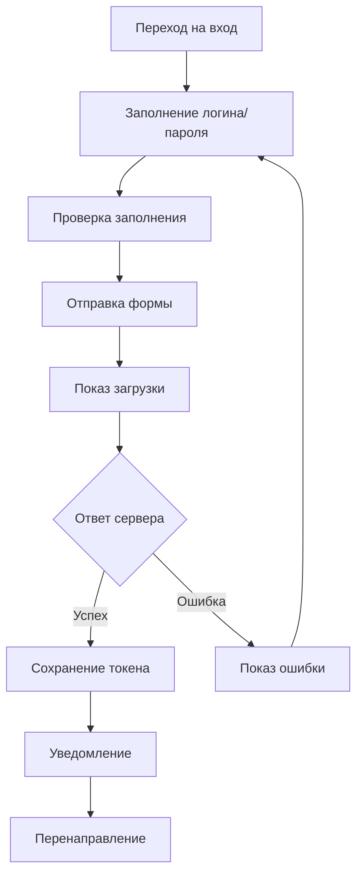

# 🎨 Урок 15: Создание фронтенда авторизации - Обзор

## 🎯 Цель урока

Научиться создавать полноценный фронтенд для системы авторизации и регистрации с современным дизайном, валидацией и пользовательским опытом.

## 📋 План обучения

### 🗺️ Структура уроков:

1. **15_FRONTEND_AUTH_OVERVIEW.md** - Обзор и планирование
2. **16_REGISTRATION_PAGE.md** - Создание страницы регистрации
3. **17_LOGIN_PAGE.md** - Создание страницы входа
4. **18_AUTH_STYLING.md** - Стилизация форм авторизации
5. **19_VALIDATION_UX.md** - Валидация и пользовательский опыт
6. **20_AUTH_SCRIPTS.md** - JavaScript для авторизации

## 🏗️ Архитектура фронтенда

```
public/
├── html/
│   ├── register.html          # Страница регистрации
│   ├── login.html             # Страница входа
│   ├── forgot-password.html   # Восстановление пароля
│   └── profile.html           # Профиль пользователя
├── style/
│   ├── auth.css              # Стили для авторизации
│   ├── forms.css             # Общие стили форм
│   └── responsive.css        # Адаптивность
├── scripts/
│   ├── auth-utils.js         # Утилиты авторизации
│   ├── register.js           # Логика регистрации
│   ├── login.js              # Логика входа
│   ├── validation.js         # Валидация форм
│   └── notifications.js      # Система уведомлений
└── img/
    ├── auth-bg.jpg           # Фон для страниц авторизации
    ├── icons/                # Иконки
    └── logo.png              # Логотип
```

## 📱 Дизайн-система

### 🎨 Цветовая схема:

```css
:root {
  /* Основные цвета */
  --primary-color: #2563eb; /* Синий */
  --primary-dark: #1d4ed8; /* Темно-синий */
  --primary-light: #3b82f6; /* Светло-синий */

  /* Акцентные цвета */
  --success-color: #059669; /* Зеленый */
  --error-color: #dc2626; /* Красный */
  --warning-color: #d97706; /* Оранжевый */
  --info-color: #0891b2; /* Голубой */

  /* Нейтральные цвета */
  --gray-50: #f9fafb;
  --gray-100: #f3f4f6;
  --gray-200: #e5e7eb;
  --gray-300: #d1d5db;
  --gray-400: #9ca3af;
  --gray-500: #6b7280;
  --gray-600: #4b5563;
  --gray-700: #374151;
  --gray-800: #1f2937;
  --gray-900: #111827;

  /* Фон и текст */
  --bg-primary: #ffffff;
  --bg-secondary: #f8fafc;
  --text-primary: #1f2937;
  --text-secondary: #6b7280;
}
```

### 📏 Типографика:

```css
:root {
  /* Размеры шрифтов */
  --text-xs: 0.75rem; /* 12px */
  --text-sm: 0.875rem; /* 14px */
  --text-base: 1rem; /* 16px */
  --text-lg: 1.125rem; /* 18px */
  --text-xl: 1.25rem; /* 20px */
  --text-2xl: 1.5rem; /* 24px */
  --text-3xl: 1.875rem; /* 30px */
  --text-4xl: 2.25rem; /* 36px */

  /* Веса шрифтов */
  --font-light: 300;
  --font-normal: 400;
  --font-medium: 500;
  --font-semibold: 600;
  --font-bold: 700;

  /* Шрифты */
  --font-family: "Inter", "Segoe UI", Tahoma, Geneva, Verdana, sans-serif;
}
```

### 📐 Отступы и размеры:

```css
:root {
  /* Отступы */
  --spacing-1: 0.25rem; /* 4px */
  --spacing-2: 0.5rem; /* 8px */
  --spacing-3: 0.75rem; /* 12px */
  --spacing-4: 1rem; /* 16px */
  --spacing-5: 1.25rem; /* 20px */
  --spacing-6: 1.5rem; /* 24px */
  --spacing-8: 2rem; /* 32px */
  --spacing-10: 2.5rem; /* 40px */
  --spacing-12: 3rem; /* 48px */
  --spacing-16: 4rem; /* 64px */

  /* Радиусы скругления */
  --radius-sm: 0.25rem; /* 4px */
  --radius-md: 0.375rem; /* 6px */
  --radius-lg: 0.5rem; /* 8px */
  --radius-xl: 0.75rem; /* 12px */
  --radius-2xl: 1rem; /* 16px */
  --radius-full: 9999px; /* Полный круг */

  /* Тени */
  --shadow-sm: 0 1px 2px 0 rgba(0, 0, 0, 0.05);
  --shadow-md: 0 4px 6px -1px rgba(0, 0, 0, 0.1);
  --shadow-lg: 0 10px 15px -3px rgba(0, 0, 0, 0.1);
  --shadow-xl: 0 20px 25px -5px rgba(0, 0, 0, 0.1);
}
```

## 🧩 Компоненты UI

### 📝 Формы:

- **Input Fields** - поля ввода с анимацией
- **Buttons** - кнопки с состояниями загрузки
- **Validation Messages** - сообщения об ошибках
- **Progress Indicators** - индикаторы прогресса

### 🔔 Уведомления:

- **Success Messages** - успешные операции
- **Error Messages** - ошибки и предупреждения
- **Loading States** - состояния загрузки
- **Toast Notifications** - всплывающие уведомления

### 📱 Адаптивность:

- **Desktop** - 1200px и больше
- **Tablet** - 768px - 1199px
- **Mobile** - до 767px

## 🎯 Пользовательский опыт (UX)

### ✅ Принципы UX:

1. **Простота** - минимум полей, понятные инструкции
2. **Обратная связь** - мгновенная валидация и уведомления
3. **Прогрессивность** - пошаговое заполнение сложных форм
4. **Доступность** - поддержка клавиатуры и скринридеров
5. **Безопасность** - индикаторы силы пароля и подсказки

### 🔄 Потоки пользователя:

#### Регистрация:



#### Вход в систему:



## 📋 Технические требования

### 🛠️ Технологии:

- **HTML5** - семантическая разметка
- **CSS3** - современные возможности стилизации
- **Vanilla JavaScript** - без фреймворков для обучения
- **Fetch API** - для HTTP запросов
- **LocalStorage** - для хранения токенов
- **FormData API** - для работы с формами

### ✅ Функциональные требования:

#### Регистрация:

- [ ] Валидация email в реальном времени
- [ ] Проверка силы пароля
- [ ] Подтверждение пароля
- [ ] Проверка уникальности username
- [ ] Показ ошибок сервера
- [ ] Успешная регистрация с перенаправлением

#### Вход в систему:

- [ ] Вход по email или username
- [ ] Запоминание пользователя (Remember Me)
- [ ] Восстановление пароля
- [ ] Блокировка при многих неудачных попытках
- [ ] Перенаправление после входа

#### Общие требования:

- [ ] Адаптивный дизайн
- [ ] Доступность (a11y)
- [ ] Быстрая загрузка
- [ ] SEO оптимизация
- [ ] Кроссбраузерность

### 🎨 Дизайн требования:

- [ ] Современный минималистичный дизайн
- [ ] Анимации и переходы
- [ ] Состояния загрузки
- [ ] Микроинтерактивности
- [ ] Консистентность с основным сайтом

## 📊 Метрики и аналитика

### 📈 Отслеживаемые события:

- Загрузка страниц авторизации
- Начало заполнения форм
- Ошибки валидации
- Успешная регистрация/вход
- Время заполнения форм
- Источники трафика

### 🔍 A/B тестирование:

- Разные варианты форм
- Различные тексты CTA кнопок
- Альтернативные схемы валидации
- Разные потоки регистрации

## 🗂️ Структура файлов проекта

```
d:\01_bookstore\
├── GUIDES\
│   ├── 15_FRONTEND_AUTH_OVERVIEW.md
│   ├── 16_REGISTRATION_PAGE.md
│   ├── 17_LOGIN_PAGE.md
│   ├── 18_AUTH_STYLING.md
│   ├── 19_VALIDATION_UX.md
│   └── 20_AUTH_SCRIPTS.md
├── public\
│   ├── html\
│   │   ├── register.html
│   │   ├── login.html
│   │   ├── forgot-password.html
│   │   └── verify-email.html
│   ├── style\
│   │   ├── auth.css
│   │   ├── forms.css
│   │   ├── components.css
│   │   └── responsive.css
│   ├── scripts\
│   │   ├── auth-utils.js
│   │   ├── register.js
│   │   ├── login.js
│   │   ├── validation.js
│   │   ├── form-helpers.js
│   │   └── notifications.js
│   └── img\
│       ├── auth\
│       │   ├── background.jpg
│       │   ├── success.svg
│       │   └── error.svg
│       └── icons\
│           ├── eye.svg
│           ├── eye-off.svg
│           ├── check.svg
│           └── x.svg
```

## 🎓 Результаты обучения

После прохождения всех уроков студент сможет:

1. **Создавать современные формы** авторизации
2. **Реализовывать валидацию** на клиенте
3. **Работать с API** для авторизации
4. **Создавать адаптивный дизайн**
5. **Обеспечивать хороший UX**
6. **Тестировать формы** на разных устройствах

## 🚀 Следующий урок

**[Урок 16: Создание страницы регистрации](16_REGISTRATION_PAGE.md)**

В следующем уроке мы создадим полную страницу регистрации с современным дизайном и функциональностью.

---

**Готовы начать создание фронтенда авторизации?** 🎨
