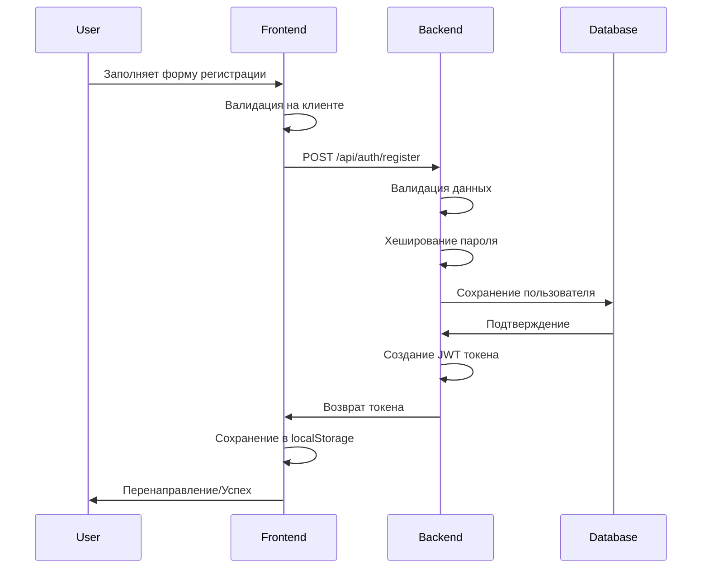
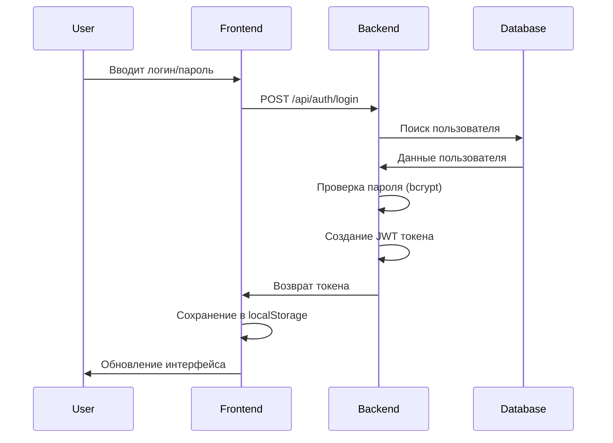
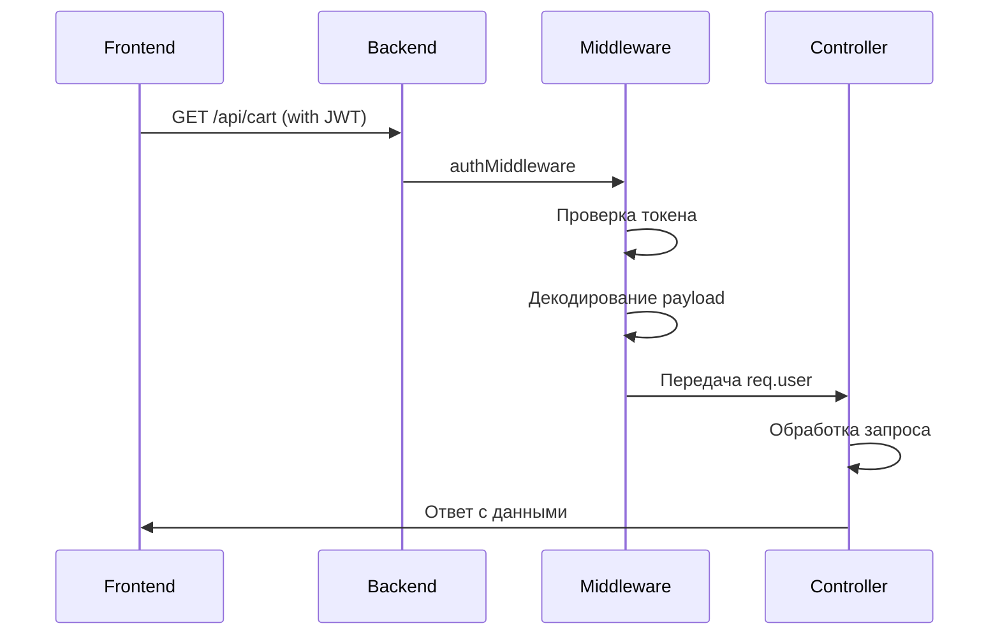

# 🔐 Урок 1: Основы авторизации

## 📚 Что такое авторизация?

**Авторизация** - это процесс проверки прав доступа пользователя к определенным ресурсам или действиям в системе.

### 🔍 Основные понятия:

#### 1. **Аутентификация** vs **Авторизация**

```
┌─────────────────┐    ┌─────────────────┐
│ Аутентификация  │ -> │   Авторизация   │
│ "Кто ты?"       │    │ "Что ты можешь?" │
│                 │    │                 │
│ • Вход в систему│    │ • Доступ к API  │
│ • Проверка       │    │ • Права на      │
│   пароля        │    │   действия      │
└─────────────────┘    └─────────────────┘
```

#### 2. **Типы авторизации:**

- **Session-based** - использует сессии на сервере
- **Token-based** - использует токены (JWT)
- **OAuth** - делегированная авторизация
- **API Keys** - ключи для API доступа

## 🏗 Архитектура нашей системы

### Компоненты системы авторизации BookStore2:

```
┌──────────────────────────────────────────────────────┐
│                    FRONTEND                          │
├──────────────────────────────────────────────────────┤
│ • register.html - Форма регистрации                  │
│ • login.html - Форма входа                           │
│ • auth-utils.js - Утилиты для работы с токенами      │
└──────────────────────────────────────────────────────┘
                            │
                    HTTP Requests
                            │
                            ▼
┌──────────────────────────────────────────────────────┐
│                    BACKEND                           │
├──────────────────────────────────────────────────────┤
│ • authRoutes.js - Маршруты /api/auth/*               │
│ • authController.js - Логика авторизации             │
│ • authMiddleware.js - Проверка токенов               │
└──────────────────────────────────────────────────────┘
                            │
                      SQL Queries
                            │
                            ▼
┌──────────────────────────────────────────────────────┐
│                   DATABASE                           │
├──────────────────────────────────────────────────────┤
│ • users - Таблица пользователей                      │
│   - id, username, email, password, firstName, etc.  │
└──────────────────────────────────────────────────────┘
```

## 🔑 JWT токены в BookStore2

### Что такое JWT?

**JWT (JSON Web Token)** - это стандарт для безопасной передачи информации между сторонами в виде JSON объекта.

### Структура JWT:

```
Header.Payload.Signature
xxxxx.yyyyy.zzzzz
```

#### 1. **Header** (Заголовок):

```json
{
  "alg": "HS256",
  "typ": "JWT"
}
```

#### 2. **Payload** (Полезная нагрузка):

```json
{
  "userId": 123,
  "username": "john_doe",
  "email": "john@example.com",
  "iat": 1635724800,
  "exp": 1635811200
}
```

#### 3. **Signature** (Подпись):

```
HMACSHA256(
  base64UrlEncode(header) + "." +
  base64UrlEncode(payload),
  secret
)
```

## 🔒 Безопасность паролей

### Хеширование с bcrypt:

```javascript
const bcrypt = require("bcrypt");

// Хеширование при регистрации
const saltRounds = 10;
const hashedPassword = await bcrypt.hash(password, saltRounds);

// Проверка при входе
const isValid = await bcrypt.compare(password, hashedPassword);
```

### Почему bcrypt?

- ✅ **Соль** - защита от rainbow tables
- ✅ **Медленность** - защита от brute force
- ✅ **Адаптивность** - можно увеличить сложность

## 🌊 Поток авторизации

### 1. Регистрация пользователя:



### 2. Вход в систему:



### 3. Защищенный запрос:



## 📁 Структура файлов

### Backend файлы:

```
src/
├── controllers/
│   └── authController.js      # Логика регистрации/входа
├── middleware/
│   └── authMiddleware.js      # Проверка JWT токенов
├── routes/
│   └── authRoutes.js          # Маршруты авторизации
└── utils/
    └── jwt.js                 # Утилиты для работы с JWT
```

### Frontend файлы:

```
public/
├── html/
│   ├── register.html          # Форма регистрации
│   └── login.html             # Форма входа
└── scripts/
    └── auth-utils.js          # Управление токенами и состоянием
```

## 🎯 Ключевые принципы безопасности

### 1. **Валидация данных:**

```javascript
// На клиенте (UX)
if (!email.includes("@")) {
  showError("Неверный формат email");
}

// На сервере (безопасность)
const { error } = userSchema.validate(userData);
if (error) {
  return res.status(400).json({ message: error.details[0].message });
}
```

### 2. **Хранение токенов:**

```javascript
// ✅ Хорошо - localStorage для SPA
localStorage.setItem("authToken", token);

// ❌ Плохо - глобальные переменные
window.authToken = token;
```

### 3. **Время жизни токенов:**

```javascript
// Короткое время жизни для безопасности
const token = jwt.sign(payload, secret, { expiresIn: "1h" });
```

### 4. **Обработка ошибок:**

```javascript
// Не раскрывать детали о существовании пользователя
if (!user || !validPassword) {
  return res.status(401).json({
    message: "Неверные учетные данные",
  });
}
```

## 🧪 Практическое задание

### Задача 1: Анализ JWT токена

1. Перейдите на https://jwt.io
2. Вставьте JWT токен из localStorage вашего браузера
3. Изучите содержимое payload
4. Проверьте время истечения токена

### Задача 2: Тестирование безопасности

1. Попробуйте войти с неверными данными
2. Попробуйте получить доступ к `/api/cart` без токена
3. Измените токен в localStorage и попробуйте сделать запрос

## 📝 Проверочные вопросы

1. В чем разница между аутентификацией и авторизацией?
2. Из каких частей состоит JWT токен?
3. Почему мы используем bcrypt для хеширования паролей?
4. Где хранится JWT токен в нашем приложении?
5. Что происходит при истечении срока действия токена?

## 🔗 Полезные ссылки

- [JWT Official Site](https://jwt.io/)
- [bcrypt Documentation](https://www.npmjs.com/package/bcrypt)
- [OWASP Authentication Guide](https://owasp.org/www-project-cheat-sheets/cheatsheets/Authentication_Cheat_Sheet.html)
- [MDN Web Storage API](https://developer.mozilla.org/en-US/docs/Web/API/Web_Storage_API)

---

**Следующий урок:** [Урок 2: JWT токены подробно](02_JWT_TOKENS.md) 🚀

**Практика:** Попробуйте зарегистрироваться в системе и изучите созданный токен!
