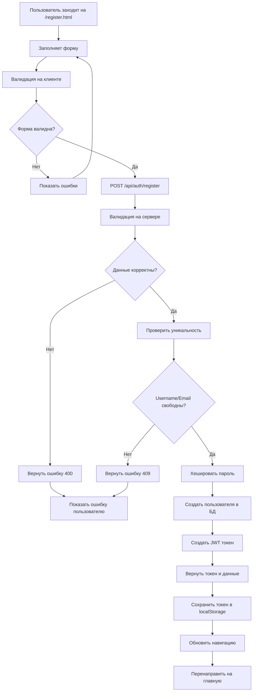

# 👤 Урок 5: Регистрация пользователей

## 🎯 Процесс регистрации пользователей

В этом уроке подробно разберем весь процесс регистрации в BookStore2: от заполнения формы до создания аккаунта и автоматического входа.

## 🔄 Полный поток регистрации



## 📋 Структура формы регистрации

### HTML форма (register.html):

```html
<form id="registerForm" class="form-box">
  <!-- Имя и фамилия в одном ряду -->
  <div class="form-row">
    <div class="form-group">
      <label for="firstName">Имя *</label>
      <input
        type="text"
        id="firstName"
        name="firstName"
        required
        placeholder="Введите ваше имя"
        maxlength="50"
      />
      <span class="error-message" id="firstName-error"></span>
    </div>

    <div class="form-group">
      <label for="lastName">Фамилия *</label>
      <input
        type="text"
        id="lastName"
        name="lastName"
        required
        placeholder="Введите вашу фамилию"
        maxlength="50"
      />
      <span class="error-message" id="lastName-error"></span>
    </div>
  </div>

  <!-- Email -->
  <div class="form-group">
    <label for="email">Email *</label>
    <input
      type="email"
      id="email"
      name="email"
      required
      placeholder="example@email.com"
      maxlength="100"
    />
    <span class="error-message" id="email-error"></span>
  </div>

  <!-- Username (автоматически из email) -->
  <div class="form-group">
    <label for="username">Логин</label>
    <input
      type="text"
      id="username"
      name="username"
      placeholder="Будет создан автоматически из email"
      maxlength="30"
    />
    <div class="field-hint">
      <small>Оставьте пустым для автоматического создания из email</small>
    </div>
    <span class="error-message" id="username-error"></span>
  </div>

  <!-- Пароль с требованиями -->
  <div class="form-group">
    <label for="password">Пароль *</label>
    <input
      type="password"
      id="password"
      name="password"
      required
      placeholder="Минимум 6 символов"
      maxlength="128"
    />
    <div class="password-requirements">
      <small>Пароль должен содержать:</small>
      <ul>
        <li id="req-length">Минимум 6 символов</li>
        <li id="req-upper">Минимум 1 заглавную букву (A-Z)</li>
        <li id="req-lower">Строчные буквы (a-z)</li>
        <li id="req-number">Минимум 1 цифру (0-9)</li>
      </ul>
    </div>
    <span class="error-message" id="password-error"></span>
  </div>

  <!-- Подтверждение пароля -->
  <div class="form-group">
    <label for="confirmPassword">Подтверждение пароля *</label>
    <input
      type="password"
      id="confirmPassword"
      name="confirmPassword"
      required
      placeholder="Повторите пароль"
    />
    <span class="error-message" id="confirmPassword-error"></span>
  </div>

  <!-- Согласие с условиями -->
  <div class="form-group checkbox-group">
    <label class="checkbox-label">
      <input type="checkbox" id="agreeTerms" required />
      <span class="checkmark"></span>
      Я согласен с <a href="#" target="_blank">условиями использования</a>
    </label>
    <span class="error-message" id="agreeTerms-error"></span>
  </div>

  <!-- Кнопка отправки -->
  <button type="submit" class="form-btn" id="registerBtn">
    <span class="btn-text">Зарегистрироваться</span>
    <span class="btn-loader" style="display: none;">Регистрация...</span>
  </button>

  <!-- Ссылка на вход -->
  <div class="form-footer">
    <p>Уже есть аккаунт? <a href="login.html">Войти</a></p>
  </div>
</form>
```

## ✅ Валидация на клиенте

### Расширенная валидация в register.js:

```javascript
// public/scripts/register.js

class RegistrationValidator {
  constructor() {
    this.initializeForm();
    this.setupRealTimeValidation();
  }

  initializeForm() {
    this.form = document.getElementById("registerForm");
    this.submitBtn = document.getElementById("registerBtn");

    // Элементы формы
    this.inputs = {
      firstName: document.getElementById("firstName"),
      lastName: document.getElementById("lastName"),
      email: document.getElementById("email"),
      username: document.getElementById("username"),
      password: document.getElementById("password"),
      confirmPassword: document.getElementById("confirmPassword"),
      agreeTerms: document.getElementById("agreeTerms"),
    };

    // Состояние валидации
    this.validationState = {
      firstName: false,
      lastName: false,
      email: false,
      username: true, // опциональное поле
      password: false,
      confirmPassword: false,
      agreeTerms: false,
    };
  }

  setupRealTimeValidation() {
    // Валидация имени и фамилии
    this.inputs.firstName.addEventListener("input", () => {
      this.validateName("firstName");
    });

    this.inputs.lastName.addEventListener("input", () => {
      this.validateName("lastName");
    });

    // Валидация email с автоматическим созданием username
    this.inputs.email.addEventListener("input", () => {
      this.validateEmail();
      this.generateUsernameFromEmail();
    });

    // Валидация username
    this.inputs.username.addEventListener("input", () => {
      this.validateUsername();
    });

    // Валидация пароля в реальном времени
    this.inputs.password.addEventListener("input", () => {
      this.validatePassword();
      this.validatePasswordMatch(); // Перепроверяем совпадение
    });

    // Валидация совпадения паролей
    this.inputs.confirmPassword.addEventListener("input", () => {
      this.validatePasswordMatch();
    });

    // Валидация согласия с условиями
    this.inputs.agreeTerms.addEventListener("change", () => {
      this.validateTermsAgreement();
    });

    // Обработка отправки формы
    this.form.addEventListener("submit", (e) => {
      this.handleSubmit(e);
    });
  }

  // Валидация имени/фамилии
  validateName(fieldName) {
    const input = this.inputs[fieldName];
    const value = input.value.trim();

    const rules = {
      minLength: 2,
      maxLength: 50,
      pattern: /^[а-яёa-z\s-]+$/iu, // Русские, английские буквы, пробелы, дефисы
    };

    let isValid = true;
    let message = "";

    if (!value) {
      isValid = false;
      message = "Это поле обязательно";
    } else if (value.length < rules.minLength) {
      isValid = false;
      message = `Минимум ${rules.minLength} символа`;
    } else if (value.length > rules.maxLength) {
      isValid = false;
      message = `Максимум ${rules.maxLength} символов`;
    } else if (!rules.pattern.test(value)) {
      isValid = false;
      message = "Только буквы, пробелы и дефисы";
    }

    this.setFieldValidation(fieldName, isValid, message);
    return isValid;
  }

  // Валидация email
  validateEmail() {
    const email = this.inputs.email.value.trim();
    const emailRegex = /^[^\s@]+@[^\s@]+\.[^\s@]+$/;

    let isValid = true;
    let message = "";

    if (!email) {
      isValid = false;
      message = "Email обязателен";
    } else if (!emailRegex.test(email)) {
      isValid = false;
      message = "Некорректный формат email";
    } else if (email.length > 100) {
      isValid = false;
      message = "Email слишком длинный";
    }

    this.setFieldValidation("email", isValid, message);
    return isValid;
  }

  // Автоматическое создание username из email
  generateUsernameFromEmail() {
    const email = this.inputs.email.value.trim();
    const username = this.inputs.username.value.trim();

    // Создаем username только если поле пустое
    if (email && !username) {
      const emailPart = email.split("@")[0];
      const cleanUsername = emailPart
        .replace(/[^a-zA-Z0-9]/g, "") // Удаляем специальные символы
        .toLowerCase()
        .substring(0, 30); // Ограничиваем длину

      this.inputs.username.value = cleanUsername;
      this.validateUsername();
    }
  }

  // Валидация username
  validateUsername() {
    const username = this.inputs.username.value.trim();

    // Username опциональный, если пустой - будет создан из email
    if (!username) {
      this.setFieldValidation("username", true, "");
      return true;
    }

    const rules = {
      minLength: 3,
      maxLength: 30,
      pattern: /^[a-zA-Z0-9_]+$/, // Только латинские буквы, цифры, подчеркивание
    };

    let isValid = true;
    let message = "";

    if (username.length < rules.minLength) {
      isValid = false;
      message = `Минимум ${rules.minLength} символа`;
    } else if (username.length > rules.maxLength) {
      isValid = false;
      message = `Максимум ${rules.maxLength} символов`;
    } else if (!rules.pattern.test(username)) {
      isValid = false;
      message = "Только латинские буквы, цифры и подчеркивание";
    }

    this.setFieldValidation("username", isValid, message);
    return isValid;
  }

  // Валидация пароля с визуальными индикаторами
  validatePassword() {
    const password = this.inputs.password.value;

    const requirements = {
      length: password.length >= 6,
      upper: /[A-Z]/.test(password),
      lower: /[a-z]/.test(password),
      number: /\d/.test(password),
    };

    // Обновляем визуальные индикаторы
    this.updatePasswordRequirements(requirements);

    const allRequirementsMet = Object.values(requirements).every((req) => req);
    const message = allRequirementsMet
      ? ""
      : "Пароль не соответствует требованиям";

    this.setFieldValidation("password", allRequirementsMet, message);
    return allRequirementsMet;
  }

  // Обновление визуальных индикаторов требований к паролю
  updatePasswordRequirements(requirements) {
    const indicators = {
      "req-length": requirements.length,
      "req-upper": requirements.upper,
      "req-lower": requirements.lower,
      "req-number": requirements.number,
    };

    Object.entries(indicators).forEach(([id, isValid]) => {
      const element = document.getElementById(id);
      if (element) {
        element.style.color = isValid ? "#27ae60" : "#e74c3c";
        element.style.fontWeight = isValid ? "bold" : "normal";
      }
    });
  }

  // Валидация совпадения паролей
  validatePasswordMatch() {
    const password = this.inputs.password.value;
    const confirmPassword = this.inputs.confirmPassword.value;

    if (!confirmPassword) {
      this.setFieldValidation("confirmPassword", false, "");
      return false;
    }

    const isValid = password === confirmPassword;
    const message = isValid ? "" : "Пароли не совпадают";

    this.setFieldValidation("confirmPassword", isValid, message);
    return isValid;
  }

  // Валидация согласия с условиями
  validateTermsAgreement() {
    const isChecked = this.inputs.agreeTerms.checked;
    const message = isChecked ? "" : "Необходимо согласие с условиями";

    this.setFieldValidation("agreeTerms", isChecked, message);
    return isChecked;
  }

  // Установка визуального состояния валидации поля
  setFieldValidation(fieldName, isValid, message) {
    const input = this.inputs[fieldName];
    const errorElement = document.getElementById(`${fieldName}-error`);

    // Обновляем состояние валидации
    this.validationState[fieldName] = isValid;

    // Визуальное оформление поля
    if (input.type !== "checkbox") {
      input.classList.toggle("error", !isValid && message);
      input.classList.toggle("valid", isValid && input.value.trim());
    }

    // Показываем/скрываем сообщение об ошибке
    if (errorElement) {
      errorElement.textContent = message;
      errorElement.style.display = message ? "block" : "none";
    }

    // Обновляем состояние кнопки отправки
    this.updateSubmitButton();
  }

  // Обновление состояния кнопки отправки
  updateSubmitButton() {
    const allValid = Object.values(this.validationState).every(
      (state) => state
    );
    this.submitBtn.disabled = !allValid;

    if (allValid) {
      this.submitBtn.classList.add("enabled");
    } else {
      this.submitBtn.classList.remove("enabled");
    }
  }

  // Полная валидация формы перед отправкой
  validateAllFields() {
    const results = {
      firstName: this.validateName("firstName"),
      lastName: this.validateName("lastName"),
      email: this.validateEmail(),
      username: this.validateUsername(),
      password: this.validatePassword(),
      confirmPassword: this.validatePasswordMatch(),
      agreeTerms: this.validateTermsAgreement(),
    };

    return Object.values(results).every((result) => result);
  }

  // Обработка отправки формы
  async handleSubmit(event) {
    event.preventDefault();

    // Полная валидация перед отправкой
    if (!this.validateAllFields()) {
      Notifications.error("Пожалуйста, исправьте ошибки в форме");
      return;
    }

    this.setLoading(true);

    try {
      // Подготавливаем данные
      const formData = this.collectFormData();

      // Отправляем на сервер
      const response = await fetch("/api/auth/register", {
        method: "POST",
        headers: {
          "Content-Type": "application/json",
        },
        body: JSON.stringify(formData),
      });

      const result = await response.json();

      if (response.ok && result.success) {
        await this.handleSuccessfulRegistration(result);
      } else {
        this.handleRegistrationError(result, response.status);
      }
    } catch (error) {
      this.handleNetworkError(error);
    } finally {
      this.setLoading(false);
    }
  }

  // Сбор данных формы
  collectFormData() {
    return {
      firstName: this.inputs.firstName.value.trim(),
      lastName: this.inputs.lastName.value.trim(),
      email: this.inputs.email.value.trim(),
      username:
        this.inputs.username.value.trim() ||
        this.inputs.email.value.split("@")[0].replace(/[^a-zA-Z0-9]/g, ""),
      password: this.inputs.password.value,
    };
  }

  // Обработка успешной регистрации
  async handleSuccessfulRegistration(result) {
    Notifications.success("🎉 Регистрация прошла успешно!");

    // Сохраняем токен и данные пользователя
    Auth.login(result.token, result.user);

    // Показываем приветствие
    const userName = result.user.firstName || result.user.username;
    setTimeout(() => {
      Notifications.success(`Добро пожаловать, ${userName}!`);
    }, 1000);

    // Перенаправляем на главную страницу
    setTimeout(() => {
      window.location.href = "../index.html";
    }, 2500);
  }

  // Обработка ошибок регистрации
  handleRegistrationError(result, status) {
    if (status === 409) {
      // Конфликт - пользователь уже существует
      if (result.message.includes("email")) {
        this.setFieldValidation(
          "email",
          false,
          "Пользователь с таким email уже существует"
        );
      } else if (result.message.includes("username")) {
        this.setFieldValidation("username", false, "Такой логин уже занят");
      } else {
        Notifications.error(result.message);
      }
    } else if (status === 400) {
      // Ошибки валидации
      if (result.errors && Array.isArray(result.errors)) {
        result.errors.forEach((error) => {
          Notifications.error(error);
        });
      } else {
        Notifications.error(result.message || "Ошибка валидации данных");
      }
    } else {
      Notifications.error(result.message || "Ошибка регистрации");
    }
  }

  // Обработка сетевых ошибок
  handleNetworkError(error) {
    console.error("Ошибка регистрации:", error);

    if (error.name === "TypeError" && error.message.includes("fetch")) {
      Notifications.error(
        "Ошибка подключения к серверу. Проверьте интернет-соединение."
      );
    } else {
      Notifications.error("Произошла неожиданная ошибка. Попробуйте еще раз.");
    }
  }

  // Управление состоянием загрузки
  setLoading(isLoading) {
    const btnText = this.submitBtn.querySelector(".btn-text");
    const btnLoader = this.submitBtn.querySelector(".btn-loader");

    if (isLoading) {
      this.submitBtn.disabled = true;
      btnText.style.display = "none";
      btnLoader.style.display = "inline-flex";
    } else {
      this.submitBtn.disabled = false;
      btnText.style.display = "inline";
      btnLoader.style.display = "none";
    }
  }
}

// Инициализация при загрузке DOM
document.addEventListener("DOMContentLoaded", function () {
  // Проверяем, не авторизован ли уже пользователь
  if (Auth.isAuthenticated()) {
    Notifications.info("Вы уже авторизованы");
    setTimeout(() => {
      window.location.href = "../index.html";
    }, 1000);
    return;
  }

  // Инициализируем валидатор регистрации
  new RegistrationValidator();

  console.log("🔐 Страница регистрации загружена");
});
```

## 🎨 Продвинутые CSS стили

### Стили для улучшенной валидации:

```css
/* Улучшенные стили для полей формы */
.form-group input {
  transition: all 0.3s ease;
}

.form-group input:focus {
  transform: translateY(-1px);
  box-shadow: 0 4px 12px rgba(39, 174, 96, 0.15);
}

.form-group input.valid {
  border-color: #27ae60;
  background-color: #f8fff9;
  box-shadow: 0 0 0 3px rgba(39, 174, 96, 0.1);
}

.form-group input.error {
  border-color: #e74c3c;
  background-color: #fff5f5;
  box-shadow: 0 0 0 3px rgba(231, 76, 60, 0.1);
}

/* Стили для требований к паролю */
.password-requirements {
  margin-top: 8px;
  padding: 12px;
  background: #f8f9fa;
  border-radius: 6px;
  border-left: 4px solid #17a2b8;
}

.password-requirements small {
  color: #6c757d;
  font-weight: 600;
  display: block;
  margin-bottom: 8px;
}

.password-requirements ul {
  list-style: none;
  padding: 0;
  margin: 0;
}

.password-requirements li {
  padding: 3px 0;
  font-size: 13px;
  transition: all 0.3s ease;
  position: relative;
  padding-left: 20px;
}

.password-requirements li::before {
  content: "×";
  position: absolute;
  left: 0;
  top: 50%;
  transform: translateY(-50%);
  color: #e74c3c;
  font-weight: bold;
  transition: all 0.3s ease;
}

.password-requirements li[style*="color: rgb(39, 174, 96)"]::before {
  content: "✓";
  color: #27ae60;
}

/* Стили для кнопки отправки */
.form-btn {
  transition: all 0.3s ease;
  position: relative;
  overflow: hidden;
}

.form-btn:disabled {
  opacity: 0.6;
  cursor: not-allowed;
  transform: none !important;
}

.form-btn.enabled {
  background: linear-gradient(135deg, #27ae60 0%, #2ecc71 100%);
  box-shadow: 0 4px 15px rgba(39, 174, 96, 0.3);
}

.form-btn.enabled:hover {
  box-shadow: 0 6px 20px rgba(39, 174, 96, 0.4);
  transform: translateY(-2px);
}

/* Анимация при успешной регистрации */
.form-wrapper.success {
  animation: successPulse 0.6s ease-in-out;
}

@keyframes successPulse {
  0% {
    transform: scale(1);
  }
  50% {
    transform: scale(1.02);
  }
  100% {
    transform: scale(1);
  }
}

/* Подсказки для полей */
.field-hint {
  margin-top: 4px;
}

.field-hint small {
  color: #6c757d;
  font-size: 12px;
  font-style: italic;
}

/* Адаптивность для мобильных */
@media (max-width: 480px) {
  .password-requirements {
    font-size: 12px;
  }

  .password-requirements li {
    font-size: 11px;
  }
}
```

## 📊 Аналитика и отслеживание

### Добавление метрик регистрации:

```javascript
// Дополнительные функции для отслеживания
class RegistrationAnalytics {
  static trackFormStart() {
    const startTime = Date.now();
    sessionStorage.setItem("registrationStartTime", startTime);

    // Отправляем событие начала регистрации
    this.sendEvent("registration_started", {
      timestamp: startTime,
      userAgent: navigator.userAgent,
      referrer: document.referrer,
    });
  }

  static trackFormSubmit() {
    const startTime = sessionStorage.getItem("registrationStartTime");
    const endTime = Date.now();
    const duration = startTime ? endTime - startTime : 0;

    this.sendEvent("registration_attempted", {
      duration: duration,
      timestamp: endTime,
    });
  }

  static trackValidationErrors(errors) {
    this.sendEvent("registration_validation_errors", {
      errors: errors,
      timestamp: Date.now(),
    });
  }

  static trackSuccess() {
    const startTime = sessionStorage.getItem("registrationStartTime");
    const endTime = Date.now();
    const duration = startTime ? endTime - startTime : 0;

    this.sendEvent("registration_completed", {
      duration: duration,
      timestamp: endTime,
    });

    sessionStorage.removeItem("registrationStartTime");
  }

  static sendEvent(eventName, data) {
    // Отправляем данные на сервер аналитики
    if (window.gtag) {
      gtag("event", eventName, data);
    }

    // Или отправляем на собственный сервер
    fetch("/api/analytics/event", {
      method: "POST",
      headers: { "Content-Type": "application/json" },
      body: JSON.stringify({ event: eventName, data }),
    }).catch((err) => console.log("Analytics error:", err));
  }
}
```

## 🧪 Практические задания

### Задание 1: Проверка уникальности в реальном времени

Добавьте проверку уникальности email и username во время ввода:

```javascript
// Дебаунсинг для проверки уникальности
const checkUniqueness = debounce(async (field, value) => {
  try {
    const response = await fetch(`/api/auth/check-unique?${field}=${value}`);
    const result = await response.json();

    if (!result.isUnique) {
      setFieldValidation(field, false, `Такой ${field} уже занят`);
    }
  } catch (error) {
    console.error("Ошибка проверки уникальности:", error);
  }
}, 500);
```

### Задание 2: Социальная регистрация

Добавьте кнопки для регистрации через Google/Facebook.

### Задание 3: Email подтверждение

Реализуйте систему подтверждения email после регистрации.

### Задание 4: Силa пароля

Добавьте индикатор силы пароля в реальном времени.

---

**Следующий урок:** [Урок 6: Вход в систему](06_USER_LOGIN.md) 🚀

**Практика:** Попробуйте зарегистрировать несколько тестовых аккаунтов и изучите процесс валидации!
