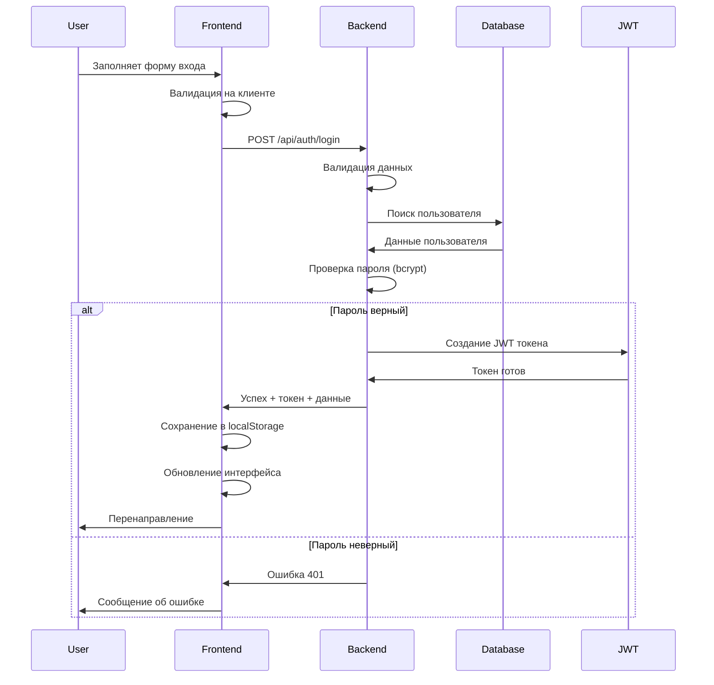

# 🔑 Урок 6: Вход в систему

## 🎯 Процесс аутентификации пользователей

В этом уроке разберем процесс входа в систему: валидацию учетных данных, проверку пароля и создание сессии пользователя.

## 🔄 Поток аутентификации



## 📋 Форма входа в систему

### HTML структура (login.html):

```html
<form id="loginForm" class="form-box">
  <!-- Логин (username или email) -->
  <div class="form-group">
    <label for="login">Логин или Email</label>
    <input
      type="text"
      id="login"
      name="login"
      required
      placeholder="Введите логин или email"
      autocomplete="username"
      maxlength="100"
    />
    <span class="error-message" id="login-error"></span>
  </div>

  <!-- Пароль -->
  <div class="form-group">
    <label for="password">Пароль</label>
    <div class="password-input-wrapper">
      <input
        type="password"
        id="password"
        name="password"
        required
        placeholder="Введите пароль"
        autocomplete="current-password"
        maxlength="128"
      />
      <button type="button" class="password-toggle" id="passwordToggle">
        <span class="toggle-icon">👁️</span>
      </button>
    </div>
    <span class="error-message" id="password-error"></span>
  </div>

  <!-- Запомнить меня -->
  <div class="form-group checkbox-group">
    <label class="checkbox-label">
      <input type="checkbox" id="rememberMe" name="rememberMe">
      <span class="checkmark"></span>
      Запомнить меня
    </label>
    <a href="forgot-password.html" class="forgot-password-link">
      Забыли пароль?
    </a>
  </div>

  <!-- Кнопка входа -->
  <button type="submit" class="form-btn" id="loginBtn">
    <span class="btn-text">Войти</span>
    <span class="btn-loader" style="display: none;">Вход...</span>
  </button>

  <!-- Разделитель -->
  <div class="form-divider">
    <span>или</span>
  </div>

  <!-- Социальные сети (будущее) -->
  <div class="social-login">
    <button type="button" class="social-btn google-btn" disabled>
      <span class="social-icon">🔍</span>
      Войти через Google
    </button>
    <button type="button" class="social-btn facebook-btn" disabled>
      <span class="social-icon">📘</span>
      Войти через Facebook
    </button>
  </div>

  <!-- Ссылка на регистрацию -->
  <div class="form-footer">
    <p>Нет аккаунта? <a href="register.html">Зарегистрироваться</a></p>
  </div>
</form>
```

## 🔐 Логика входа (login.js)

### Полный код login.js:

```javascript
// public/scripts/login.js

class LoginManager {
  constructor() {
    this.initializeForm();
    this.setupEventListeners();
    this.initializeFeatures();
  }

  initializeForm() {
    this.form = document.getElementById('loginForm');
    this.submitBtn = document.getElementById('loginBtn');
    
    // Элементы формы
    this.inputs = {
      login: document.getElementById('login'),
      password: document.getElementById('password'),
      rememberMe: document.getElementById('rememberMe')
    };

    // Кнопки
    this.passwordToggle = document.getElementById('passwordToggle');
    
    // Состояние
    this.isLoading = false;
    this.loginAttempts = this.getLoginAttempts();
  }

  setupEventListeners() {
    // Обработка отправки формы
    this.form.addEventListener('submit', (e) => this.handleSubmit(e));

    // Очистка ошибок при вводе
    this.inputs.login.addEventListener('input', () => this.clearFieldError('login'));
    this.inputs.password.addEventListener('input', () => this.clearFieldError('password'));

    // Переключатель видимости пароля
    if (this.passwordToggle) {
      this.passwordToggle.addEventListener('click', () => this.togglePasswordVisibility());
    }

    // Автозаполнение из localStorage при загрузке
    this.loadSavedLogin();

    // Сохранение логина при изменении checkbox
    this.inputs.rememberMe.addEventListener('change', () => {
      if (!this.inputs.rememberMe.checked) {
        localStorage.removeItem('savedLogin');
      }
    });

    // Enter в поле логина переходит к паролю
    this.inputs.login.addEventListener('keypress', (e) => {
      if (e.key === 'Enter' && this.inputs.login.value.trim()) {
        e.preventDefault();
        this.inputs.password.focus();
      }
    });
  }

  initializeFeatures() {
    // Показываем подсказку, если есть сохраненный логин
    if (localStorage.getItem('savedLogin')) {
      this.inputs.rememberMe.checked = true;
    }

    // Проверяем rate limiting
    this.checkRateLimit();
  }

  // Валидация полей
  validateForm() {
    const login = this.inputs.login.value.trim();
    const password = this.inputs.password.value;

    let isValid = true;

    // Проверка логина
    if (!login) {
      this.setFieldError('login', 'Введите логин или email');
      isValid = false;
    } else if (login.length < 3) {
      this.setFieldError('login', 'Логин должен содержать минимум 3 символа');
      isValid = false;
    }

    // Проверка пароля
    if (!password) {
      this.setFieldError('password', 'Введите пароль');
      isValid = false;
    } else if (password.length < 6) {
      this.setFieldError('password', 'Пароль должен содержать минимум 6 символов');
      isValid = false;
    }

    return isValid;
  }

  // Установка ошибки для поля
  setFieldError(fieldName, message) {
    const input = this.inputs[fieldName];
    const errorElement = document.getElementById(`${fieldName}-error`);

    input.classList.add('error');
    if (errorElement) {
      errorElement.textContent = message;
      errorElement.style.display = 'block';
    }
  }

  // Очистка ошибки поля
  clearFieldError(fieldName) {
    const input = this.inputs[fieldName];
    const errorElement = document.getElementById(`${fieldName}-error`);

    input.classList.remove('error');
    if (errorElement) {
      errorElement.textContent = '';
      errorElement.style.display = 'none';
    }
  }

  // Очистка всех ошибок
  clearAllErrors() {
    Object.keys(this.inputs).forEach(fieldName => {
      if (fieldName !== 'rememberMe') {
        this.clearFieldError(fieldName);
      }
    });
  }

  // Переключение видимости пароля
  togglePasswordVisibility() {
    const passwordInput = this.inputs.password;
    const toggleIcon = this.passwordToggle.querySelector('.toggle-icon');

    if (passwordInput.type === 'password') {
      passwordInput.type = 'text';
      toggleIcon.textContent = '🙈';
      this.passwordToggle.setAttribute('aria-label', 'Скрыть пароль');
    } else {
      passwordInput.type = 'password';
      toggleIcon.textContent = '👁️';
      this.passwordToggle.setAttribute('aria-label', 'Показать пароль');
    }
  }

  // Сохранение/загрузка логина
  saveLogin(login) {
    if (this.inputs.rememberMe.checked) {
      localStorage.setItem('savedLogin', login);
    }
  }

  loadSavedLogin() {
    const savedLogin = localStorage.getItem('savedLogin');
    if (savedLogin) {
      this.inputs.login.value = savedLogin;
      this.inputs.rememberMe.checked = true;
      // Фокусируемся на поле пароля
      this.inputs.password.focus();
    } else {
      // Фокусируемся на поле логина
      this.inputs.login.focus();
    }
  }

  // Rate limiting (защита от брут-форса)
  getLoginAttempts() {
    const attempts = localStorage.getItem('loginAttempts');
    return attempts ? JSON.parse(attempts) : { count: 0, lastAttempt: 0 };
  }

  updateLoginAttempts(success = false) {
    if (success) {
      // Сброс счетчика при успешном входе
      localStorage.removeItem('loginAttempts');
      this.loginAttempts = { count: 0, lastAttempt: 0 };
    } else {
      // Увеличение счетчика неудачных попыток
      this.loginAttempts.count++;
      this.loginAttempts.lastAttempt = Date.now();
      localStorage.setItem('loginAttempts', JSON.stringify(this.loginAttempts));
    }
  }

  checkRateLimit() {
    const maxAttempts = 5;
    const lockoutTime = 15 * 60 * 1000; // 15 минут

    if (this.loginAttempts.count >= maxAttempts) {
      const timeSinceLastAttempt = Date.now() - this.loginAttempts.lastAttempt;
      
      if (timeSinceLastAttempt < lockoutTime) {
        const remainingTime = Math.ceil((lockoutTime - timeSinceLastAttempt) / 60000);
        const message = `Слишком много неудачных попыток входа. Попробуйте через ${remainingTime} мин.`;
        
        Notifications.error(message);
        this.submitBtn.disabled = true;
        this.submitBtn.textContent = `Заблокировано (${remainingTime} мин)`;
        
        // Таймер для разблокировки
        setTimeout(() => {
          this.loginAttempts = { count: 0, lastAttempt: 0 };
          localStorage.removeItem('loginAttempts');
          this.submitBtn.disabled = false;
          this.submitBtn.innerHTML = '<span class="btn-text">Войти</span>';
          Notifications.info('Блокировка снята. Можете попробовать снова.');
        }, lockoutTime - timeSinceLastAttempt);
        
        return false;
      } else {
        // Сброс если прошло достаточно времени
        this.loginAttempts = { count: 0, lastAttempt: 0 };
        localStorage.removeItem('loginAttempts');
      }
    }
    
    return true;
  }

  // Обработка отправки формы
  async handleSubmit(event) {
    event.preventDefault();

    // Проверка rate limiting
    if (!this.checkRateLimit()) {
      return;
    }

    // Очистка предыдущих ошибок
    this.clearAllErrors();

    // Валидация формы
    if (!this.validateForm()) {
      return;
    }

    // Установка состояния загрузки
    this.setLoading(true);

    try {
      // Подготовка данных
      const loginData = {
        login: this.inputs.login.value.trim(),
        password: this.inputs.password.value
      };

      // Отправка запроса
      const response = await fetch('/api/auth/login', {
        method: 'POST',
        headers: {
          'Content-Type': 'application/json'
        },
        body: JSON.stringify(loginData)
      });

      const result = await response.json();

      if (response.ok && result.success) {
        await this.handleSuccessfulLogin(result);
      } else {
        this.handleLoginError(result, response.status);
      }

    } catch (error) {
      this.handleNetworkError(error);
    } finally {
      this.setLoading(false);
    }
  }

  // Обработка успешного входа
  async handleSuccessfulLogin(result) {
    // Сброс счетчика попыток
    this.updateLoginAttempts(true);

    // Сохранение логина если нужно
    this.saveLogin(this.inputs.login.value.trim());

    // Сохранение токена и пользовательских данных
    const loginSuccess = Auth.login(result.token, result.user);
    
    if (!loginSuccess) {
      throw new Error('Не удалось сохранить данные пользователя');
    }

    // Уведомление о успешном входе
    const userName = result.user.firstName || result.user.username;
    Notifications.success(`🎉 Добро пожаловать, ${userName}!`);

    // Получение URL для перенаправления
    const redirectUrl = this.getRedirectUrl();

    // Перенаправление через короткую задержку
    setTimeout(() => {
      window.location.href = redirectUrl;
    }, 1500);
  }

  // Обработка ошибок входа
  handleLoginError(result, status) {
    // Увеличение счетчика неудачных попыток
    this.updateLoginAttempts(false);

    if (status === 401) {
      // Неверные учетные данные
      Notifications.error('Неверный логин или пароль');
      
      // Очистка поля пароля и фокус на нём
      this.inputs.password.value = '';
      this.inputs.password.focus();
      
      // Подсказка о восстановлении пароля
      setTimeout(() => {
        Notifications.info('Забыли пароль? Воспользуйтесь ссылкой восстановления');
      }, 3000);
      
    } else if (status === 429) {
      // Слишком много запросов
      Notifications.error('Слишком много попыток входа. Попробуйте позже');
      
    } else if (status === 400) {
      // Ошибки валидации
      Notifications.error(result.message || 'Проверьте правильность введенных данных');
      
    } else {
      // Другие ошибки
      Notifications.error(result.message || 'Ошибка входа в систему');
    }

    // Показываем количество оставшихся попыток
    const attemptsLeft = Math.max(0, 5 - this.loginAttempts.count);
    if (attemptsLeft > 0 && attemptsLeft <= 2) {
      Notifications.warning(`Осталось попыток: ${attemptsLeft}`);
    }
  }

  // Обработка сетевых ошибок
  handleNetworkError(error) {
    console.error('Ошибка входа:', error);
    
    if (error.name === 'TypeError' && error.message.includes('fetch')) {
      Notifications.error('Ошибка подключения к серверу');
    } else {
      Notifications.error('Произошла неожиданная ошибка');
    }
  }

  // Получение URL для перенаправления
  getRedirectUrl() {
    // Проверяем сохраненный URL перенаправления
    const savedRedirect = sessionStorage.getItem('redirectAfterLogin');
    if (savedRedirect) {
      sessionStorage.removeItem('redirectAfterLogin');
      return savedRedirect;
    }

    // Проверяем параметр redirect в URL
    const urlParams = new URLSearchParams(window.location.search);
    const redirectParam = urlParams.get('redirect');
    if (redirectParam) {
      // Проверяем что URL безопасный (только относительные ссылки)
      if (redirectParam.startsWith('/') || redirectParam.startsWith('../')) {
        return redirectParam;
      }
    }

    // По умолчанию на главную страницу
    return '../index.html';
  }

  // Управление состоянием загрузки
  setLoading(isLoading) {
    this.isLoading = isLoading;
    
    const btnText = this.submitBtn.querySelector('.btn-text');
    const btnLoader = this.submitBtn.querySelector('.btn-loader');

    if (isLoading) {
      this.submitBtn.disabled = true;
      btnText.style.display = 'none';
      btnLoader.style.display = 'inline-flex';
      
      // Отключаем поля формы
      Object.values(this.inputs).forEach(input => {
        input.disabled = true;
      });
      
    } else {
      this.submitBtn.disabled = false;
      btnText.style.display = 'inline';
      btnLoader.style.display = 'none';
      
      // Включаем поля формы
      Object.values(this.inputs).forEach(input => {
        input.disabled = false;
      });
    }
  }
}

// Дополнительные утилиты для входа
class LoginUtils {
  // Проверка браузера на поддержку localStorage
  static isLocalStorageAvailable() {
    try {
      const test = '__localStorage_test__';
      localStorage.setItem(test, test);
      localStorage.removeItem(test);
      return true;
    } catch (e) {
      return false;
    }
  }

  // Генерация device fingerprint для дополнительной безопасности
  static generateDeviceFingerprint() {
    const canvas = document.createElement('canvas');
    const ctx = canvas.getContext('2d');
    ctx.textBaseline = 'top';
    ctx.font = '14px Arial';
    ctx.fillText('Device fingerprint', 2, 2);
    
    const fingerprint = {
      screen: `${screen.width}x${screen.height}`,
      timezone: Intl.DateTimeFormat().resolvedOptions().timeZone,
      language: navigator.language,
      platform: navigator.platform,
      canvas: canvas.toDataURL(),
      userAgent: navigator.userAgent.substring(0, 100) // Ограничиваем длину
    };

    return btoa(JSON.stringify(fingerprint)).substring(0, 32);
  }

  // Логирование попытки входа
  static logLoginAttempt(success, details = {}) {
    const logData = {
      timestamp: new Date().toISOString(),
      success: success,
      userAgent: navigator.userAgent,
      fingerprint: this.generateDeviceFingerprint(),
      ...details
    };

    // Отправляем на сервер (если настроено)
    fetch('/api/auth/log-attempt', {
      method: 'POST',
      headers: { 'Content-Type': 'application/json' },
      body: JSON.stringify(logData)
    }).catch(err => console.log('Logging error:', err));
  }
}

// Инициализация при загрузке DOM
document.addEventListener('DOMContentLoaded', function() {
  // Проверяем localStorage
  if (!LoginUtils.isLocalStorageAvailable()) {
    Notifications.warning('Ваш браузер не поддерживает сохранение данных. Функция "Запомнить меня" недоступна.');
  }

  // Проверяем, не авторизован ли уже пользователь
  if (Auth.isAuthenticated()) {
    const user = Auth.getCurrentUser();
    if (user) {
      Notifications.info(`Вы уже авторизованы как ${user.firstName || user.username}`);
      setTimeout(() => {
        window.location.href = '../index.html';
      }, 1000);
      return;
    }
  }

  // Инициализируем менеджер входа
  const loginManager = new LoginManager();

  // Показываем подсказку если пришли со страницы требующей авторизации
  const urlParams = new URLSearchParams(window.location.search);
  if (urlParams.get('required') === 'true') {
    Notifications.info('Для доступа к этой странице требуется авторизация');
  }

  console.log('🔐 Страница входа загружена');
});
```

## 🎨 CSS стили для формы входа

### Дополнительные стили:

```css
/* Стили для переключателя пароля */
.password-input-wrapper {
  position: relative;
}

.password-toggle {
  position: absolute;
  right: 12px;
  top: 50%;
  transform: translateY(-50%);
  background: none;
  border: none;
  cursor: pointer;
  padding: 4px;
  font-size: 16px;
  color: #666;
  transition: color 0.3s ease;
}

.password-toggle:hover {
  color: #333;
}

.password-toggle:focus {
  outline: 2px solid #27ae60;
  outline-offset: 2px;
  border-radius: 4px;
}

/* Checkbox для "Запомнить меня" */
.checkbox-group {
  display: flex;
  justify-content: space-between;
  align-items: center;
  margin: 20px 0;
}

.forgot-password-link {
  color: #3498db;
  text-decoration: none;
  font-size: 14px;
  font-weight: 500;
}

.forgot-password-link:hover {
  text-decoration: underline;
}

/* Разделитель */
.form-divider {
  display: flex;
  align-items: center;
  margin: 30px 0 20px 0;
  color: #666;
  font-size: 14px;
}

.form-divider::before,
.form-divider::after {
  content: '';
  flex: 1;
  height: 1px;
  background: #ddd;
}

.form-divider span {
  padding: 0 15px;
  background: white;
}

/* Социальные сети */
.social-login {
  display: flex;
  flex-direction: column;
  gap: 12px;
  margin-bottom: 20px;
}

.social-btn {
  display: flex;
  align-items: center;
  justify-content: center;
  gap: 10px;
  padding: 12px 20px;
  border: 2px solid #ddd;
  border-radius: 8px;
  background: white;
  color: #333;
  font-size: 14px;
  font-weight: 500;
  cursor: pointer;
  transition: all 0.3s ease;
}

.social-btn:disabled {
  opacity: 0.5;
  cursor: not-allowed;
}

.social-btn:not(:disabled):hover {
  border-color: #bbb;
  background: #f8f9fa;
}

.google-btn {
  border-color: #db4437;
  color: #db4437;
}

.google-btn:not(:disabled):hover {
  background: #db4437;
  color: white;
}

.facebook-btn {
  border-color: #3b5998;
  color: #3b5998;
}

.facebook-btn:not(:disabled):hover {
  background: #3b5998;
  color: white;
}

/* Анимация для заблокированной кнопки */
.form-btn.locked {
  background: #95a5a6;
  cursor: not-allowed;
  position: relative;
  overflow: hidden;
}

.form-btn.locked::after {
  content: '';
  position: absolute;
  top: 0;
  left: -100%;
  width: 100%;
  height: 100%;
  background: linear-gradient(90deg, transparent, rgba(255,255,255,0.2), transparent);
  animation: shimmer 2s infinite;
}

@keyframes shimmer {
  0% { left: -100%; }
  100% { left: 100%; }
}

/* Мобильная адаптация */
@media (max-width: 480px) {
  .checkbox-group {
    flex-direction: column;
    align-items: flex-start;
    gap: 10px;
  }
  
  .social-login {
    gap: 8px;
  }
  
  .social-btn {
    padding: 10px 16px;
    font-size: 13px;
  }
}
```

## 🔐 Безопасность входа

### Дополнительные меры безопасности:

```javascript
// Расширение для безопасности
class LoginSecurity {
  // Проверка на подозрительную активность
  static detectSuspiciousActivity() {
    const indicators = {
      multipleTabsOpen: this.countOpenTabs() > 3,
      rapidRequests: this.checkRequestFrequency(),
      suspiciousUserAgent: this.checkUserAgent(),
      vpnDetected: false // Можно добавить проверку VPN
    };

    if (Object.values(indicators).some(indicator => indicator)) {
      console.warn('Подозрительная активность обнаружена', indicators);
      return true;
    }
    return false;
  }

  // Подсчет открытых вкладок
  static countOpenTabs() {
    try {
      const tabId = Date.now();
      localStorage.setItem('lastTabId', tabId);
      
      // Упрощенная проверка количества вкладок
      const tabs = JSON.parse(localStorage.getItem('openTabs') || '[]');
      const activeTabs = tabs.filter(tab => Date.now() - tab < 5000);
      activeTabs.push(tabId);
      
      localStorage.setItem('openTabs', JSON.stringify(activeTabs));
      return activeTabs.length;
    } catch {
      return 1;
    }
  }

  // Проверка частоты запросов
  static checkRequestFrequency() {
    const requests = JSON.parse(localStorage.getItem('loginRequests') || '[]');
    const recentRequests = requests.filter(time => Date.now() - time < 60000);
    
    return recentRequests.length > 5; // Более 5 запросов в минуту
  }

  // Проверка User Agent
  static checkUserAgent() {
    const ua = navigator.userAgent;
    const suspiciousPatterns = [
      /headless/i,
      /phantom/i,
      /selenium/i,
      /webdriver/i,
      /bot/i
    ];
    
    return suspiciousPatterns.some(pattern => pattern.test(ua));
  }

  // Логирование запроса входа
  static logRequest() {
    const requests = JSON.parse(localStorage.getItem('loginRequests') || '[]');
    requests.push(Date.now());
    
    // Оставляем только последние 10 запросов
    const recentRequests = requests.slice(-10);
    localStorage.setItem('loginRequests', JSON.stringify(recentRequests));
  }
}
```

## 📊 Аналитика входа

### Сбор данных о входе:

```javascript
class LoginAnalytics {
  static trackLoginStart() {
    const startTime = Date.now();
    sessionStorage.setItem('loginStartTime', startTime);
    
    this.sendEvent('login_started', {
      timestamp: startTime,
      page: window.location.pathname,
      referrer: document.referrer
    });
  }

  static trackLoginAttempt(success, details = {}) {
    const startTime = sessionStorage.getItem('loginStartTime');
    const duration = startTime ? Date.now() - startTime : 0;

    this.sendEvent('login_attempted', {
      success: success,
      duration: duration,
      attempts: this.getAttemptCount(),
      ...details
    });
  }

  static trackLoginSuccess(user) {
    const startTime = sessionStorage.getItem('loginStartTime');
    const duration = startTime ? Date.now() - startTime : 0;

    this.sendEvent('login_completed', {
      userId: user.userId,
      duration: duration,
      timestamp: Date.now()
    });

    sessionStorage.removeItem('loginStartTime');
  }

  static getAttemptCount() {
    const attempts = JSON.parse(localStorage.getItem('loginAttempts') || '{"count": 0}');
    return attempts.count;
  }

  static sendEvent(eventName, data) {
    // Отправка в Google Analytics
    if (window.gtag) {
      gtag('event', eventName, data);
    }

    // Отправка на собственный сервер
    fetch('/api/analytics/login-event', {
      method: 'POST',
      headers: { 'Content-Type': 'application/json' },
      body: JSON.stringify({ event: eventName, data })
    }).catch(err => console.log('Analytics error:', err));
  }
}
```

## 🧪 Практические задания

### Задание 1: Двухфакторная аутентификация

Добавьте поддержку 2FA с SMS или TOTP кодами.

### Задание 2: Восстановление пароля

Реализуйте полную систему восстановления пароля через email.

### Задание 3: Социальная авторизация

Интегрируйте OAuth для входа через Google/Facebook.

### Задание 4: Биометрическая аутентификация

Добавьте поддержку WebAuthn для входа по отпечатку пальца.

---

**Следующий урок:** [Урок 7: Защищенные маршруты](07_PROTECTED_ROUTES.md) 🚀

**Практика:** Протестируйте систему входа с различными сценариями и изучите работу rate limiting!