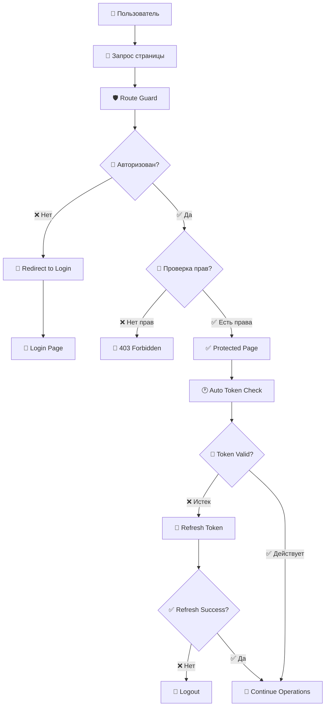

# 🛡️ Урок 7: Защищенные маршруты

## 🎯 Контроль доступа и авторизация

В этом уроке изучим создание защищенных маршрутов, проверку прав доступа и middleware для авторизации на клиенте и сервере.

## 🗺️ Архитектура защищенных маршрутов



## 🔐 Серверные middleware для защиты

### authMiddleware.js (обновленная версия):

```javascript
// src/middleware/authMiddleware.js

const jwt = require("jsonwebtoken");
const { User, Role, Permission } = require("../models");

class AuthMiddleware {
  // Базовая проверка аутентификации
  static async authenticate(req, res, next) {
    try {
      // Получение токена из headers
      const authHeader = req.headers.authorization;
      if (!authHeader) {
        return res.status(401).json({
          success: false,
          message: "Токен доступа не предоставлен",
          code: "NO_TOKEN",
        });
      }

      // Проверка формата токена
      const token = authHeader.startsWith("Bearer ")
        ? authHeader.slice(7)
        : authHeader;

      if (!token) {
        return res.status(401).json({
          success: false,
          message: "Некорректный формат токена",
          code: "INVALID_TOKEN_FORMAT",
        });
      }

      // Декодирование и проверка токена
      const decoded = jwt.verify(token, process.env.JWT_SECRET);

      // Получение пользователя из базы данных
      const user = await User.findByPk(decoded.userId, {
        include: [
          {
            model: Role,
            include: [Permission],
          },
        ],
      });

      if (!user) {
        return res.status(401).json({
          success: false,
          message: "Пользователь не найден",
          code: "USER_NOT_FOUND",
        });
      }

      // Проверка активности пользователя
      if (!user.isActive) {
        return res.status(401).json({
          success: false,
          message: "Аккаунт заблокирован",
          code: "ACCOUNT_DISABLED",
        });
      }

      // Проверка смены пароля
      const tokenIssued = new Date(decoded.iat * 1000);
      if (user.passwordChangedAt && tokenIssued < user.passwordChangedAt) {
        return res.status(401).json({
          success: false,
          message: "Токен недействителен после смены пароля",
          code: "PASSWORD_CHANGED",
        });
      }

      // Добавление пользователя в request
      req.user = user;
      req.token = token;

      // Логирование доступа
      await this.logAccess(req, user);

      next();
    } catch (error) {
      if (error.name === "TokenExpiredError") {
        return res.status(401).json({
          success: false,
          message: "Токен истек",
          code: "TOKEN_EXPIRED",
          expiredAt: error.expiredAt,
        });
      }

      if (error.name === "JsonWebTokenError") {
        return res.status(401).json({
          success: false,
          message: "Недействительный токен",
          code: "INVALID_TOKEN",
        });
      }

      console.error("Ошибка аутентификации:", error);
      return res.status(500).json({
        success: false,
        message: "Ошибка проверки аутентификации",
        code: "AUTH_ERROR",
      });
    }
  }

  // Проверка ролей пользователя
  static requireRole(...roles) {
    return async (req, res, next) => {
      try {
        if (!req.user) {
          return res.status(401).json({
            success: false,
            message: "Пользователь не аутентифицирован",
            code: "NOT_AUTHENTICATED",
          });
        }

        // Получаем роли пользователя
        const userRoles = req.user.Roles?.map((role) => role.name) || [];

        // Проверяем наличие необходимых ролей
        const hasRequiredRole = roles.some((role) => userRoles.includes(role));

        if (!hasRequiredRole) {
          return res.status(403).json({
            success: false,
            message: "Недостаточно прав доступа",
            code: "INSUFFICIENT_PERMISSIONS",
            required: roles,
            current: userRoles,
          });
        }

        next();
      } catch (error) {
        console.error("Ошибка проверки роли:", error);
        return res.status(500).json({
          success: false,
          message: "Ошибка проверки прав доступа",
          code: "AUTHORIZATION_ERROR",
        });
      }
    };
  }

  // Проверка конкретных разрешений
  static requirePermission(...permissions) {
    return async (req, res, next) => {
      try {
        if (!req.user) {
          return res.status(401).json({
            success: false,
            message: "Пользователь не аутентифицирован",
            code: "NOT_AUTHENTICATED",
          });
        }

        // Собираем все разрешения пользователя
        const userPermissions = [];
        if (req.user.Roles) {
          req.user.Roles.forEach((role) => {
            if (role.Permissions) {
              role.Permissions.forEach((permission) => {
                userPermissions.push(permission.name);
              });
            }
          });
        }

        // Проверяем наличие необходимых разрешений
        const hasRequiredPermissions = permissions.every((permission) =>
          userPermissions.includes(permission)
        );

        if (!hasRequiredPermissions) {
          return res.status(403).json({
            success: false,
            message: "Недостаточно разрешений",
            code: "INSUFFICIENT_PERMISSIONS",
            required: permissions,
            current: userPermissions,
          });
        }

        next();
      } catch (error) {
        console.error("Ошибка проверки разрешений:", error);
        return res.status(500).json({
          success: false,
          message: "Ошибка проверки разрешений",
          code: "PERMISSION_ERROR",
        });
      }
    };
  }

  // Middleware для проверки владельца ресурса
  static requireOwnership(resourceField = "userId") {
    return async (req, res, next) => {
      try {
        if (!req.user) {
          return res.status(401).json({
            success: false,
            message: "Пользователь не аутентифицирован",
            code: "NOT_AUTHENTICATED",
          });
        }

        // Получаем ID ресурса
        const resourceUserId =
          req.params[resourceField] || req.body[resourceField];

        // Проверяем является ли пользователь владельцем
        const isOwner =
          req.user.userId.toString() === resourceUserId?.toString();

        // Проверяем является ли администратором
        const userRoles = req.user.Roles?.map((role) => role.name) || [];
        const isAdmin =
          userRoles.includes("admin") || userRoles.includes("moderator");

        if (!isOwner && !isAdmin) {
          return res.status(403).json({
            success: false,
            message: "Доступ разрешен только владельцу ресурса",
            code: "OWNERSHIP_REQUIRED",
          });
        }

        next();
      } catch (error) {
        console.error("Ошибка проверки владельца:", error);
        return res.status(500).json({
          success: false,
          message: "Ошибка проверки владельца ресурса",
          code: "OWNERSHIP_ERROR",
        });
      }
    };
  }

  // Опциональная аутентификация (для публичных эндпоинтов с дополнительными возможностями)
  static optionalAuthenticate(req, res, next) {
    const authHeader = req.headers.authorization;

    if (!authHeader) {
      req.user = null;
      return next();
    }

    // Используем обычную аутентификацию, но игнорируем ошибки
    AuthMiddleware.authenticate(req, res, (error) => {
      if (error) {
        req.user = null;
      }
      next();
    });
  }

  // Логирование доступа
  static async logAccess(req, user) {
    try {
      // Определяем тип операции
      const operation = `${req.method} ${req.path}`;

      // Создаем запись в логах (можно отправлять в отдельную таблицу или сервис)
      const logData = {
        userId: user.userId,
        operation: operation,
        ip: req.ip || req.connection.remoteAddress,
        userAgent: req.headers["user-agent"],
        timestamp: new Date(),
        success: true,
      };

      // Отправляем в систему логирования
      console.log("Доступ разрешен:", logData);

      // Можно добавить запись в базу данных
      // await AccessLog.create(logData);
    } catch (error) {
      console.error("Ошибка логирования доступа:", error);
    }
  }

  // Rate limiting для API
  static rateLimit(maxRequests = 100, windowMs = 15 * 60 * 1000) {
    const requests = new Map();

    return (req, res, next) => {
      const key = req.ip || req.connection.remoteAddress;
      const now = Date.now();

      // Очищаем старые записи
      if (requests.has(key)) {
        const userRequests = requests.get(key);
        const filteredRequests = userRequests.filter(
          (time) => now - time < windowMs
        );
        requests.set(key, filteredRequests);
      }

      // Проверяем лимит
      const userRequests = requests.get(key) || [];
      if (userRequests.length >= maxRequests) {
        return res.status(429).json({
          success: false,
          message: "Слишком много запросов",
          code: "RATE_LIMIT_EXCEEDED",
          retryAfter: Math.ceil(windowMs / 1000),
        });
      }

      // Добавляем текущий запрос
      userRequests.push(now);
      requests.set(key, userRequests);

      next();
    };
  }
}

module.exports = AuthMiddleware;
```

## 🛡️ Клиентские Route Guards

### routeGuard.js - защита маршрутов на клиенте:

```javascript
// public/scripts/route-guard.js

class RouteGuard {
  constructor() {
    this.initializeGuards();
  }

  // Инициализация защиты маршрутов
  initializeGuards() {
    // Определяем защищенные страницы
    this.protectedPages = {
      "/cart.html": {
        requireAuth: true,
        roles: ["user", "admin"],
      },
      "/profile.html": {
        requireAuth: true,
        roles: ["user", "admin"],
      },
      "/admin/": {
        requireAuth: true,
        roles: ["admin"],
      },
      "/orders.html": {
        requireAuth: true,
        roles: ["user", "admin"],
      },
    };

    // Публичные страницы (доступны без авторизации)
    this.publicPages = [
      "/",
      "/index.html",
      "/login.html",
      "/register.html",
      "/catalog.html",
      "/about.html",
      "/contacts.html",
    ];

    // Перенаправления для неавторизованных пользователей
    this.authRedirectPages = ["/login.html", "/register.html"];

    this.checkCurrentPage();
    this.setupNavigationGuards();
  }

  // Проверка текущей страницы
  checkCurrentPage() {
    const currentPath = window.location.pathname;

    // Если пользователь авторизован и находится на странице входа/регистрации
    if (
      Auth.isAuthenticated() &&
      this.authRedirectPages.includes(currentPath)
    ) {
      this.redirectToHome();
      return;
    }

    // Проверяем защищенные страницы
    const pageConfig = this.getPageConfig(currentPath);
    if (pageConfig) {
      this.checkPageAccess(pageConfig);
    }
  }

  // Получение конфигурации страницы
  getPageConfig(path) {
    // Точное совпадение
    if (this.protectedPages[path]) {
      return this.protectedPages[path];
    }

    // Проверка по паттернам (например, /admin/)
    for (const [pattern, config] of Object.entries(this.protectedPages)) {
      if (pattern.endsWith("/") && path.startsWith(pattern)) {
        return config;
      }
    }

    return null;
  }

  // Проверка доступа к странице
  checkPageAccess(pageConfig) {
    // Проверка аутентификации
    if (pageConfig.requireAuth && !Auth.isAuthenticated()) {
      this.redirectToLogin();
      return false;
    }

    // Проверка ролей
    if (pageConfig.roles) {
      const user = Auth.getCurrentUser();
      if (!user || !this.hasRequiredRole(user, pageConfig.roles)) {
        this.showAccessDenied();
        return false;
      }
    }

    return true;
  }

  // Проверка ролей пользователя
  hasRequiredRole(user, requiredRoles) {
    if (!user.roles || user.roles.length === 0) {
      return false;
    }

    return requiredRoles.some((role) => user.roles.includes(role));
  }

  // Настройка guards для навигации
  setupNavigationGuards() {
    // Перехват кликов по ссылкам
    document.addEventListener("click", (event) => {
      const link = event.target.closest("a");
      if (!link) return;

      const href = link.getAttribute("href");
      if (!href || href.startsWith("http") || href.startsWith("#")) return;

      const pageConfig = this.getPageConfig(href);
      if (pageConfig && !this.checkPageAccess(pageConfig)) {
        event.preventDefault();
      }
    });

    // Перехват изменения URL (для SPA)
    window.addEventListener("popstate", () => {
      setTimeout(() => this.checkCurrentPage(), 0);
    });
  }

  // Перенаправление на страницу входа
  redirectToLogin() {
    // Сохраняем текущий URL для возврата после входа
    sessionStorage.setItem(
      "redirectAfterLogin",
      window.location.pathname + window.location.search
    );

    Notifications.warning("Для доступа к этой странице требуется авторизация");

    setTimeout(() => {
      window.location.href = "/login.html?required=true";
    }, 1500);
  }

  // Перенаправление на главную страницу
  redirectToHome() {
    Notifications.info("Вы уже авторизованы");

    setTimeout(() => {
      window.location.href = "/index.html";
    }, 1000);
  }

  // Показать сообщение об отказе в доступе
  showAccessDenied() {
    const user = Auth.getCurrentUser();

    // Создаем страницу ошибки 403
    document.body.innerHTML = `
      <div class="access-denied-container">
        <div class="access-denied-content">
          <div class="error-icon">🚫</div>
          <h1>Доступ запрещен</h1>
          <p>У вас недостаточно прав для просмотра этой страницы.</p>
          ${
            user
              ? `
            <div class="user-info">
              <p><strong>Пользователь:</strong> ${
                user.firstName || user.username
              }</p>
              <p><strong>Роли:</strong> ${
                user.roles?.join(", ") || "Нет ролей"
              }</p>
            </div>
          `
              : ""
          }
          <div class="actions">
            <button onclick="history.back()" class="btn btn-secondary">
              ← Назад
            </button>
            <a href="/index.html" class="btn btn-primary">
              🏠 На главную
            </a>
            ${
              !user
                ? `
              <a href="/login.html" class="btn btn-success">
                🔐 Войти
              </a>
            `
                : ""
            }
          </div>
        </div>
      </div>
    `;

    // Добавляем стили для страницы ошибки
    this.injectAccessDeniedStyles();
  }

  // Стили для страницы отказа в доступе
  injectAccessDeniedStyles() {
    const style = document.createElement("style");
    style.textContent = `
      .access-denied-container {
        min-height: 100vh;
        display: flex;
        align-items: center;
        justify-content: center;
        background: linear-gradient(135deg, #667eea 0%, #764ba2 100%);
        font-family: 'Segoe UI', Tahoma, Geneva, Verdana, sans-serif;
      }

      .access-denied-content {
        background: white;
        padding: 50px;
        border-radius: 20px;
        box-shadow: 0 20px 40px rgba(0,0,0,0.1);
        text-align: center;
        max-width: 500px;
        margin: 20px;
      }

      .error-icon {
        font-size: 80px;
        margin-bottom: 20px;
      }

      .access-denied-content h1 {
        color: #333;
        margin-bottom: 15px;
        font-size: 28px;
      }

      .access-denied-content p {
        color: #666;
        margin-bottom: 25px;
        font-size: 16px;
        line-height: 1.5;
      }

      .user-info {
        background: #f8f9fa;
        padding: 20px;
        border-radius: 10px;
        margin: 25px 0;
        text-align: left;
      }

      .user-info p {
        margin: 5px 0;
        font-size: 14px;
      }

      .actions {
        display: flex;
        gap: 15px;
        justify-content: center;
        flex-wrap: wrap;
      }

      .btn {
        padding: 12px 24px;
        border: none;
        border-radius: 8px;
        text-decoration: none;
        font-weight: 500;
        cursor: pointer;
        transition: all 0.3s ease;
        display: inline-flex;
        align-items: center;
        gap: 8px;
      }

      .btn-primary {
        background: #007bff;
        color: white;
      }

      .btn-secondary {
        background: #6c757d;
        color: white;
      }

      .btn-success {
        background: #28a745;
        color: white;
      }

      .btn:hover {
        transform: translateY(-2px);
        box-shadow: 0 5px 15px rgba(0,0,0,0.2);
      }

      @media (max-width: 480px) {
        .access-denied-content {
          padding: 30px 20px;
        }
        
        .actions {
          flex-direction: column;
        }
        
        .btn {
          justify-content: center;
        }
      }
    `;

    document.head.appendChild(style);
  }

  // Проверка доступа к API endpoint
  static async checkApiAccess(endpoint, method = "GET") {
    try {
      const token = Auth.getToken();
      if (!token) {
        throw new Error("Токен не найден");
      }

      const response = await fetch(endpoint, {
        method: method,
        headers: {
          Authorization: `Bearer ${token}`,
          "Content-Type": "application/json",
        },
      });

      if (response.status === 401) {
        Auth.logout();
        window.location.href = "/login.html?required=true";
        return false;
      }

      if (response.status === 403) {
        Notifications.error(
          "У вас недостаточно прав для выполнения этого действия"
        );
        return false;
      }

      return true;
    } catch (error) {
      console.error("Ошибка проверки доступа к API:", error);
      return false;
    }
  }

  // Проверка и обновление токена перед запросом
  static async ensureValidToken() {
    if (!Auth.isAuthenticated()) {
      return false;
    }

    const token = Auth.getToken();
    if (Auth.isTokenExpired(token)) {
      // Попытка обновления токена
      const refreshed = await Auth.refreshToken();
      if (!refreshed) {
        Auth.logout();
        window.location.href = "/login.html?required=true";
        return false;
      }
    }

    return true;
  }
}

// Декоратор для автоматической проверки авторизации
class AuthRequired {
  // Декоратор для методов, требующих авторизации
  static requireAuth(target, propertyName, descriptor) {
    const method = descriptor.value;

    descriptor.value = async function (...args) {
      if (!Auth.isAuthenticated()) {
        Notifications.error("Требуется авторизация");
        window.location.href = "/login.html?required=true";
        return;
      }

      // Проверяем валидность токена
      const isValid = await RouteGuard.ensureValidToken();
      if (!isValid) {
        return;
      }

      return method.apply(this, args);
    };

    return descriptor;
  }

  // Декоратор для методов, требующих определенные роли
  static requireRole(roles) {
    return function (target, propertyName, descriptor) {
      const method = descriptor.value;

      descriptor.value = async function (...args) {
        const user = Auth.getCurrentUser();
        if (!user || !user.roles) {
          Notifications.error("Недостаточно прав доступа");
          return;
        }

        const hasRole = roles.some((role) => user.roles.includes(role));
        if (!hasRole) {
          Notifications.error(
            "У вас недостаточно прав для выполнения этого действия"
          );
          return;
        }

        return method.apply(this, args);
      };

      return descriptor;
    };
  }
}

// Инициализация при загрузке
document.addEventListener("DOMContentLoaded", function () {
  // Создаем глобальный экземпляр RouteGuard
  window.routeGuard = new RouteGuard();

  console.log("🛡️ Route Guard инициализирован");
});

// Экспорт для модулей
if (typeof module !== "undefined" && module.exports) {
  module.exports = { RouteGuard, AuthRequired };
}
```

## 🔧 Применение защиты маршрутов

### Защищенные API роуты:

```javascript
// src/routes/protected/cartRoutes.js

const express = require("express");
const router = express.Router();
const cartController = require("../../controllers/cartController");
const AuthMiddleware = require("../../middleware/authMiddleware");

// Все маршруты корзины требуют аутентификации
router.use(AuthMiddleware.authenticate);

// Получение корзины пользователя
router.get("/", cartController.getCart);

// Добавление товара в корзину
router.post("/items", cartController.addItem);

// Обновление количества товара
router.put(
  "/items/:itemId",
  AuthMiddleware.requireOwnership("userId"),
  cartController.updateItem
);

// Удаление товара из корзины
router.delete(
  "/items/:itemId",
  AuthMiddleware.requireOwnership("userId"),
  cartController.removeItem
);

// Очистка корзины
router.delete("/", cartController.clearCart);

// Оформление заказа (требует дополнительные права)
router.post(
  "/checkout",
  AuthMiddleware.requireRole("user", "premium"),
  cartController.checkout
);

module.exports = router;
```

### Административные маршруты:

```javascript
// src/routes/admin/adminRoutes.js

const express = require("express");
const router = express.Router();
const adminController = require("../../controllers/adminController");
const AuthMiddleware = require("../../middleware/authMiddleware");

// Все административные маршруты требуют роль admin
router.use(AuthMiddleware.authenticate);
router.use(AuthMiddleware.requireRole("admin"));

// Управление пользователями
router.get(
  "/users",
  AuthMiddleware.requirePermission("users.view"),
  adminController.getUsers
);

router.put(
  "/users/:userId",
  AuthMiddleware.requirePermission("users.edit"),
  adminController.updateUser
);

router.delete(
  "/users/:userId",
  AuthMiddleware.requirePermission("users.delete"),
  adminController.deleteUser
);

// Управление товарами
router.post(
  "/books",
  AuthMiddleware.requirePermission("books.create"),
  adminController.createBook
);

router.put(
  "/books/:bookId",
  AuthMiddleware.requirePermission("books.edit"),
  adminController.updateBook
);

router.delete(
  "/books/:bookId",
  AuthMiddleware.requirePermission("books.delete"),
  adminController.deleteBook
);

// Аналитика (только для супер-админов)
router.get(
  "/analytics",
  AuthMiddleware.requireRole("superadmin"),
  adminController.getAnalytics
);

module.exports = router;
```

## 📱 Защита страниц на клиенте

### Пример защищенной страницы:

```html
<!DOCTYPE html>
<html lang="ru">
  <head>
    <meta charset="UTF-8" />
    <meta name="viewport" content="width=device-width, initial-scale=1.0" />
    <title>Профиль пользователя - BookStore</title>
    <link rel="stylesheet" href="../style/main.css" />
    <link rel="stylesheet" href="../style/profile.css" />
  </head>
  <body>
    <!-- Загрузочный экран -->
    <div id="loading-screen" class="loading-screen">
      <div class="loader"></div>
      <p>Проверка доступа...</p>
    </div>

    <!-- Основной контент (скрыт до проверки авторизации) -->
    <div id="main-content" style="display: none;">
      <header>
        <nav class="navbar">
          <div class="nav-brand">
            <a href="../index.html">📚 BookStore</a>
          </div>
          <div class="nav-menu">
            <a href="../catalog.html">Каталог</a>
            <a href="../cart.html" class="nav-cart">
              🛒 Корзина <span id="cart-count">0</span>
            </a>
            <div class="user-menu">
              <span id="user-name">Пользователь</span>
              <div class="dropdown">
                <a href="#" class="active">Профиль</a>
                <a href="../orders.html">Заказы</a>
                <a href="#" onclick="Auth.logout()">Выйти</a>
              </div>
            </div>
          </div>
        </nav>
      </header>

      <main class="profile-main">
        <!-- Контент профиля -->
      </main>
    </div>

    <!-- Скрипты -->
    <script src="../scripts/notifications.js"></script>
    <script src="../scripts/auth-utils.js"></script>
    <script src="../scripts/route-guard.js"></script>
    <script src="../scripts/profile.js"></script>

    <script>
      // Проверка авторизации при загрузке страницы
      document.addEventListener("DOMContentLoaded", async function () {
        const loadingScreen = document.getElementById("loading-screen");
        const mainContent = document.getElementById("main-content");

        try {
          // Проверяем авторизацию
          if (!Auth.isAuthenticated()) {
            throw new Error("Не авторизован");
          }

          // Проверяем валидность токена
          const isValid = await RouteGuard.ensureValidToken();
          if (!isValid) {
            throw new Error("Токен недействителен");
          }

          // Получаем данные пользователя
          const user = Auth.getCurrentUser();
          if (!user) {
            throw new Error("Данные пользователя не найдены");
          }

          // Обновляем интерфейс
          document.getElementById("user-name").textContent =
            user.firstName || user.username;

          // Показываем контент
          loadingScreen.style.display = "none";
          mainContent.style.display = "block";

          // Инициализируем функционал профиля
          ProfileManager.initialize();
        } catch (error) {
          console.error("Ошибка загрузки профиля:", error);

          // Перенаправляем на страницу входа
          sessionStorage.setItem(
            "redirectAfterLogin",
            window.location.pathname
          );
          window.location.href = "../login.html?required=true";
        }
      });
    </script>
  </body>
</html>
```

## 🔄 Автообновление токена

### Система refresh token:

```javascript
// public/scripts/token-refresh.js

class TokenRefreshManager {
  constructor() {
    this.refreshInProgress = false;
    this.refreshPromise = null;
    this.setupAutoRefresh();
  }

  // Настройка автоматического обновления
  setupAutoRefresh() {
    // Проверяем токен каждые 5 минут
    setInterval(() => {
      this.checkAndRefreshToken();
    }, 5 * 60 * 1000);

    // Проверяем при активности пользователя
    ["click", "keypress", "scroll"].forEach((event) => {
      document.addEventListener(
        event,
        () => {
          this.scheduleTokenCheck();
        },
        { passive: true }
      );
    });

    // Проверяем при фокусе на окне
    window.addEventListener("focus", () => {
      this.checkAndRefreshToken();
    });
  }

  // Отложенная проверка токена
  scheduleTokenCheck() {
    if (this.checkTimeout) {
      clearTimeout(this.checkTimeout);
    }

    this.checkTimeout = setTimeout(() => {
      this.checkAndRefreshToken();
    }, 1000);
  }

  // Проверка и обновление токена
  async checkAndRefreshToken() {
    if (!Auth.isAuthenticated() || this.refreshInProgress) {
      return;
    }

    const token = Auth.getToken();
    if (!token) {
      return;
    }

    // Проверяем, истекает ли токен в ближайшие 10 минут
    const tokenData = Auth.parseToken(token);
    const expirationTime = tokenData.exp * 1000;
    const currentTime = Date.now();
    const timeUntilExpiration = expirationTime - currentTime;

    // Если токен истекает в ближайшие 10 минут, обновляем его
    if (timeUntilExpiration < 10 * 60 * 1000) {
      await this.refreshToken();
    }
  }

  // Обновление токена
  async refreshToken() {
    if (this.refreshInProgress) {
      return this.refreshPromise;
    }

    this.refreshInProgress = true;
    this.refreshPromise = this.performRefresh();

    try {
      const result = await this.refreshPromise;
      return result;
    } finally {
      this.refreshInProgress = false;
      this.refreshPromise = null;
    }
  }

  // Выполнение обновления токена
  async performRefresh() {
    try {
      const refreshToken = localStorage.getItem("refreshToken");
      if (!refreshToken) {
        throw new Error("Refresh token не найден");
      }

      const response = await fetch("/api/auth/refresh", {
        method: "POST",
        headers: {
          "Content-Type": "application/json",
        },
        body: JSON.stringify({ refreshToken }),
      });

      if (!response.ok) {
        throw new Error("Ошибка обновления токена");
      }

      const data = await response.json();

      if (data.success && data.token) {
        // Сохраняем новый токен
        Auth.saveToken(data.token);

        if (data.refreshToken) {
          localStorage.setItem("refreshToken", data.refreshToken);
        }

        console.log("🔄 Токен успешно обновлен");
        return true;
      } else {
        throw new Error("Некорректный ответ сервера");
      }
    } catch (error) {
      console.error("Ошибка обновления токена:", error);

      // Если обновление не удалось, выходим из системы
      Auth.logout();

      // Показываем уведомление
      Notifications.warning(
        "Сессия истекла. Пожалуйста, войдите в систему снова."
      );

      // Перенаправляем на страницу входа
      setTimeout(() => {
        window.location.href = "/login.html?session=expired";
      }, 2000);

      return false;
    }
  }
}

// Инициализация
document.addEventListener("DOMContentLoaded", function () {
  if (Auth.isAuthenticated()) {
    window.tokenRefreshManager = new TokenRefreshManager();
  }
});
```

## 🧪 Практические задания

### Задание 1: Иерархия ролей

Создайте систему с ролями: guest → user → moderator → admin → superadmin

### Задание 2: Временные права доступа

Реализуйте систему временных разрешений с автоматическим отзывом.

### Задание 3: Аудит доступа

Добавьте полное логирование всех попыток доступа к защищенным ресурсам.

### Задание 4: Геолокационные ограничения

Реализуйте ограничения доступа по географическому положению.

---

**Следующий урок:** [Урок 8: Безопасность и middleware](08_SECURITY_MIDDLEWARE.md) 🔒

**Практика:** Протестируйте различные сценарии доступа и изучите работу middleware!
