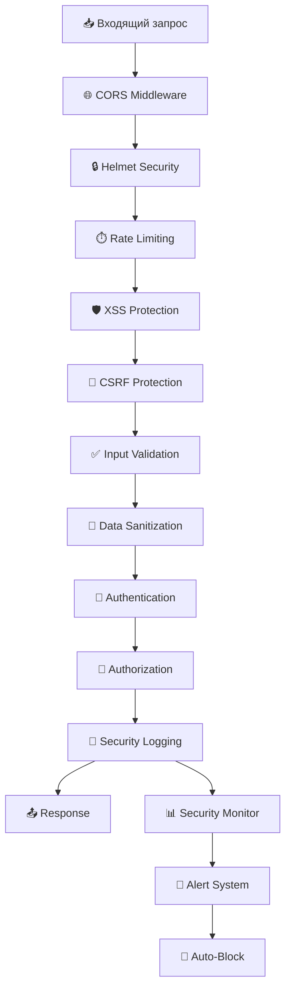

# 🔒 Урок 8: Безопасность и middleware

## 🎯 Продвинутые техники безопасности

В этом уроке изучим комплексную систему безопасности: защита от атак, валидация данных, мониторинг подозрительной активности и продвинутые middleware.

## 🛡️ Архитектура безопасности



## 🔧 Комплексная система middleware

### securityMiddleware.js:

```javascript
// src/middleware/securityMiddleware.js

const rateLimit = require("express-rate-limit");
const helmet = require("helmet");
const cors = require("cors");
const validator = require("validator");
const xss = require("xss");
const crypto = require("crypto");

class SecurityMiddleware {
  // Инициализация всех security middleware
  static initialize(app) {
    // Helmet для базовой защиты
    app.use(
      helmet({
        contentSecurityPolicy: {
          directives: {
            defaultSrc: ["'self'"],
            styleSrc: ["'self'", "'unsafe-inline'", "https:"],
            scriptSrc: ["'self'", "'unsafe-inline'"],
            imgSrc: ["'self'", "data:", "https:"],
            connectSrc: ["'self'"],
            fontSrc: ["'self'", "https:"],
            objectSrc: ["'none'"],
            mediaSrc: ["'self'"],
            frameSrc: ["'none'"],
          },
        },
        crossOriginEmbedderPolicy: false,
      })
    );

    // CORS конфигурация
    app.use(
      cors({
        origin: process.env.ALLOWED_ORIGINS?.split(",") || [
          "http://localhost:3000",
        ],
        credentials: true,
        methods: ["GET", "POST", "PUT", "DELETE", "OPTIONS"],
        allowedHeaders: ["Content-Type", "Authorization", "X-Requested-With"],
      })
    );

    // Rate limiting
    app.use("/api/", this.createRateLimit());

    // Защита от XSS
    app.use(this.xssProtection);

    // CSRF защита
    app.use(this.csrfProtection);

    // Валидация и санитизация
    app.use(this.inputValidation);

    // Мониторинг безопасности
    app.use(this.securityMonitoring);

    console.log("🔒 Security middleware инициализирован");
  }

  // Rate limiting с адаптивными лимитами
  static createRateLimit() {
    const limiter = rateLimit({
      windowMs: 15 * 60 * 1000, // 15 минут
      max: (req) => {
        // Адаптивные лимиты в зависимости от эндпоинта
        if (req.path.includes("/auth/login")) return 5;
        if (req.path.includes("/auth/register")) return 3;
        if (req.path.includes("/auth/")) return 10;
        if (req.user && req.user.roles?.includes("premium")) return 1000;
        if (req.user) return 500;
        return 100;
      },
      message: {
        success: false,
        message: "Слишком много запросов с вашего IP",
        code: "RATE_LIMIT_EXCEEDED",
        retryAfter: 15 * 60,
      },
      standardHeaders: true,
      legacyHeaders: false,
      handler: (req, res) => {
        this.logSecurityEvent(req, "RATE_LIMIT_EXCEEDED", {
          ip: req.ip,
          userAgent: req.headers["user-agent"],
          endpoint: req.path,
        });

        res.status(429).json({
          success: false,
          message: "Слишком много запросов",
          code: "RATE_LIMIT_EXCEEDED",
        });
      },
    });

    return limiter;
  }

  // Защита от XSS атак
  static xssProtection(req, res, next) {
    try {
      // Санитизация body
      if (req.body && typeof req.body === "object") {
        req.body = SecurityMiddleware.sanitizeObject(req.body);
      }

      // Санитизация query параметров
      if (req.query && typeof req.query === "object") {
        req.query = SecurityMiddleware.sanitizeObject(req.query);
      }

      // Санитизация params
      if (req.params && typeof req.params === "object") {
        req.params = SecurityMiddleware.sanitizeObject(req.params);
      }

      next();
    } catch (error) {
      console.error("Ошибка XSS защиты:", error);
      res.status(400).json({
        success: false,
        message: "Обнаружен потенциально опасный контент",
        code: "XSS_DETECTED",
      });
    }
  }

  // Рекурсивная санитизация объекта
  static sanitizeObject(obj) {
    if (typeof obj !== "object" || obj === null) {
      return typeof obj === "string" ? xss(obj) : obj;
    }

    if (Array.isArray(obj)) {
      return obj.map((item) => this.sanitizeObject(item));
    }

    const sanitized = {};
    for (const [key, value] of Object.entries(obj)) {
      sanitized[key] = this.sanitizeObject(value);
    }
    return sanitized;
  }

  // CSRF защита
  static csrfProtection(req, res, next) {
    // Пропускаем GET запросы
    if (
      req.method === "GET" ||
      req.method === "HEAD" ||
      req.method === "OPTIONS"
    ) {
      return next();
    }

    // Проверяем CSRF токен для изменяющих запросов
    const token = req.headers["x-csrf-token"] || req.body.csrfToken;
    const sessionToken = req.session?.csrfToken;

    if (!token || !sessionToken || token !== sessionToken) {
      SecurityMiddleware.logSecurityEvent(req, "CSRF_TOKEN_INVALID", {
        provided: !!token,
        session: !!sessionToken,
        match: token === sessionToken,
      });

      return res.status(403).json({
        success: false,
        message: "Недействительный CSRF токен",
        code: "CSRF_INVALID",
      });
    }

    next();
  }

  // Валидация входящих данных
  static inputValidation(req, res, next) {
    try {
      // Проверка размера payload
      const contentLength = parseInt(req.headers["content-length"]) || 0;
      const maxSize = 10 * 1024 * 1024; // 10MB

      if (contentLength > maxSize) {
        return res.status(413).json({
          success: false,
          message: "Размер запроса превышает допустимый лимит",
          code: "PAYLOAD_TOO_LARGE",
        });
      }

      // Проверка подозрительных паттернов в URL
      const suspiciousPatterns = [
        /\.\./, // Path traversal
        /<script/i, // XSS
        /union.*select/i, // SQL injection
        /javascript:/i, // Javascript injection
        /%3c.*script/i, // Encoded XSS
      ];

      const url = req.originalUrl;
      for (const pattern of suspiciousPatterns) {
        if (pattern.test(url)) {
          SecurityMiddleware.logSecurityEvent(req, "SUSPICIOUS_URL_PATTERN", {
            url: url,
            pattern: pattern.toString(),
          });

          return res.status(400).json({
            success: false,
            message: "Обнаружен подозрительный паттерн в запросе",
            code: "SUSPICIOUS_PATTERN",
          });
        }
      }

      // Валидация User-Agent
      const userAgent = req.headers["user-agent"];
      if (!userAgent || userAgent.length < 10 || userAgent.length > 500) {
        SecurityMiddleware.logSecurityEvent(req, "INVALID_USER_AGENT", {
          userAgent: userAgent,
          length: userAgent?.length || 0,
        });
      }

      next();
    } catch (error) {
      console.error("Ошибка валидации:", error);
      res.status(500).json({
        success: false,
        message: "Ошибка валидации запроса",
        code: "VALIDATION_ERROR",
      });
    }
  }

  // Мониторинг безопасности
  static securityMonitoring(req, res, next) {
    // Сохраняем время начала запроса
    req.startTime = Date.now();

    // Перехватываем ответ для логирования
    const originalSend = res.send;
    res.send = function (data) {
      req.responseTime = Date.now() - req.startTime;
      req.responseData = data;

      // Логируем подозрительные ответы
      if (res.statusCode >= 400) {
        SecurityMiddleware.logSecurityEvent(req, "HTTP_ERROR", {
          statusCode: res.statusCode,
          responseTime: req.responseTime,
          endpoint: req.path,
          method: req.method,
        });
      }

      // Проверяем на подозрительно медленные запросы
      if (req.responseTime > 5000) {
        SecurityMiddleware.logSecurityEvent(req, "SLOW_REQUEST", {
          responseTime: req.responseTime,
          endpoint: req.path,
        });
      }

      originalSend.call(this, data);
    };

    next();
  }

  // SQL Injection защита
  static sqlInjectionProtection(req, res, next) {
    const sqlPatterns = [
      /('|(\\)|(;)|(--)|(\s)|(\/\*)|(\*\/))/i,
      /(union|select|insert|delete|update|create|drop|exec|execute)/i,
      /(script|javascript|vbscript|onload|onerror|onclick)/i,
    ];

    const checkValue = (value) => {
      if (typeof value === "string") {
        for (const pattern of sqlPatterns) {
          if (pattern.test(value)) {
            return true;
          }
        }
      }
      return false;
    };

    const checkObject = (obj) => {
      for (const [key, value] of Object.entries(obj)) {
        if (checkValue(key) || checkValue(value)) {
          return true;
        }
        if (typeof value === "object" && value !== null) {
          if (checkObject(value)) {
            return true;
          }
        }
      }
      return false;
    };

    // Проверяем все входящие данные
    if (
      (req.body && checkObject(req.body)) ||
      (req.query && checkObject(req.query)) ||
      (req.params && checkObject(req.params))
    ) {
      SecurityMiddleware.logSecurityEvent(req, "SQL_INJECTION_ATTEMPT", {
        body: req.body,
        query: req.query,
        params: req.params,
      });

      return res.status(400).json({
        success: false,
        message: "Обнаружена попытка SQL инъекции",
        code: "SQL_INJECTION_DETECTED",
      });
    }

    next();
  }

  // Логирование событий безопасности
  static logSecurityEvent(req, eventType, details = {}) {
    const event = {
      timestamp: new Date().toISOString(),
      type: eventType,
      ip: req.ip || req.connection.remoteAddress,
      userAgent: req.headers["user-agent"],
      url: req.originalUrl,
      method: req.method,
      userId: req.user?.userId || null,
      sessionId: req.sessionID || null,
      ...details,
    };

    // Логируем в консоль
    console.warn("🚨 Security Event:", event);

    // Сохраняем в базу данных (асинхронно)
    this.saveSecurityEvent(event).catch((err) => {
      console.error("Ошибка сохранения события безопасности:", err);
    });

    // Проверяем на критические события
    this.checkCriticalEvent(event);
  }

  // Сохранение события в базу данных
  static async saveSecurityEvent(event) {
    try {
      // Здесь можно добавить сохранение в базу данных
      // await SecurityLog.create(event);
      // Или отправить в внешний сервис мониторинга
      // await this.sendToMonitoringService(event);
    } catch (error) {
      console.error("Ошибка сохранения события безопасности:", error);
    }
  }

  // Проверка критических событий
  static checkCriticalEvent(event) {
    const criticalEvents = [
      "SQL_INJECTION_ATTEMPT",
      "XSS_DETECTED",
      "MULTIPLE_FAILED_LOGINS",
      "BRUTE_FORCE_DETECTED",
    ];

    if (criticalEvents.includes(event.type)) {
      // Отправляем уведомление администраторам
      this.notifyAdmins(event);

      // Автоматическая блокировка IP при критических событиях
      this.autoBlockIP(event.ip, event.type);
    }
  }

  // Уведомление администраторов
  static async notifyAdmins(event) {
    try {
      // Отправка email уведомления
      // await EmailService.sendSecurityAlert(event);

      // Отправка в Slack/Telegram
      // await NotificationService.sendAlert(event);

      console.log("📧 Уведомление администраторам отправлено");
    } catch (error) {
      console.error("Ошибка отправки уведомления:", error);
    }
  }

  // Автоматическая блокировка IP
  static autoBlockIP(ip, reason) {
    try {
      // Добавляем IP в черный список
      const blockedIPs = new Set(process.env.BLOCKED_IPS?.split(",") || []);
      blockedIPs.add(ip);

      console.log(`🚫 IP ${ip} заблокирован за: ${reason}`);

      // Сохраняем в базу данных
      // await BlockedIP.create({ ip, reason, blockedAt: new Date() });
    } catch (error) {
      console.error("Ошибка блокировки IP:", error);
    }
  }

  // Проверка заблокированных IP
  static checkBlockedIP(req, res, next) {
    const clientIP = req.ip || req.connection.remoteAddress;
    const blockedIPs = process.env.BLOCKED_IPS?.split(",") || [];

    if (blockedIPs.includes(clientIP)) {
      SecurityMiddleware.logSecurityEvent(req, "BLOCKED_IP_ACCESS", {
        blockedIP: clientIP,
      });

      return res.status(403).json({
        success: false,
        message: "Доступ заблокирован",
        code: "IP_BLOCKED",
      });
    }

    next();
  }

  // Защита от брут-форс атак
  static bruteForceProtection(maxAttempts = 5, windowMs = 15 * 60 * 1000) {
    const attempts = new Map();

    return (req, res, next) => {
      const key = `${req.ip}:${req.path}`;
      const now = Date.now();

      // Очищаем старые попытки
      if (attempts.has(key)) {
        const userAttempts = attempts.get(key);
        const filteredAttempts = userAttempts.filter(
          (time) => now - time < windowMs
        );
        attempts.set(key, filteredAttempts);
      }

      const userAttempts = attempts.get(key) || [];

      if (userAttempts.length >= maxAttempts) {
        SecurityMiddleware.logSecurityEvent(req, "BRUTE_FORCE_DETECTED", {
          attempts: userAttempts.length,
          window: windowMs,
          endpoint: req.path,
        });

        return res.status(429).json({
          success: false,
          message: "Слишком много неудачных попыток",
          code: "BRUTE_FORCE_DETECTED",
          retryAfter: Math.ceil(windowMs / 1000),
        });
      }

      // Добавляем текущую попытку после неудачного запроса
      res.on("finish", () => {
        if (res.statusCode === 401 || res.statusCode === 403) {
          userAttempts.push(now);
          attempts.set(key, userAttempts);
        } else if (res.statusCode === 200) {
          // Сбрасываем счетчик при успешном запросе
          attempts.delete(key);
        }
      });

      next();
    };
  }

  // Детекция аномальной активности
  static anomalyDetection(req, res, next) {
    const userSignature = {
      ip: req.ip,
      userAgent: req.headers["user-agent"],
      acceptLanguage: req.headers["accept-language"],
      timestamp: Date.now(),
    };

    // Проверяем резкую смену характеристик пользователя
    if (req.user) {
      const userId = req.user.userId;
      const lastSignature = global.userSignatures?.[userId];

      if (lastSignature) {
        const timeDiff = userSignature.timestamp - lastSignature.timestamp;
        const locationChanged = userSignature.ip !== lastSignature.ip;
        const deviceChanged =
          userSignature.userAgent !== lastSignature.userAgent;

        // Подозрительная активность: смена IP и устройства за короткое время
        if (timeDiff < 5 * 60 * 1000 && locationChanged && deviceChanged) {
          SecurityMiddleware.logSecurityEvent(req, "SUSPICIOUS_ACTIVITY", {
            userId: userId,
            previousSignature: lastSignature,
            currentSignature: userSignature,
            timeDiff: timeDiff,
          });

          // Можно требовать дополнительную аутентификацию
          // return res.status(403).json({
          //   success: false,
          //   message: 'Требуется дополнительная верификация',
          //   code: 'ADDITIONAL_AUTH_REQUIRED'
          // });
        }
      }

      // Сохраняем текущую подпись
      if (!global.userSignatures) global.userSignatures = {};
      global.userSignatures[userId] = userSignature;
    }

    next();
  }
}

// Класс для мониторинга безопасности в реальном времени
class SecurityMonitor {
  constructor() {
    this.events = [];
    this.alerts = [];
    this.setupRealTimeMonitoring();
  }

  setupRealTimeMonitoring() {
    // Анализ событий каждые 30 секунд
    setInterval(() => {
      this.analyzeEvents();
    }, 30 * 1000);

    // Очистка старых событий каждые 10 минут
    setInterval(() => {
      this.cleanupOldEvents();
    }, 10 * 60 * 1000);
  }

  addEvent(event) {
    this.events.push({
      ...event,
      id: crypto.randomUUID(),
      timestamp: Date.now(),
    });

    // Немедленный анализ критических событий
    if (this.isCriticalEvent(event)) {
      this.processCriticalEvent(event);
    }
  }

  analyzeEvents() {
    const recentEvents = this.getRecentEvents(5 * 60 * 1000); // Последние 5 минут

    // Анализ паттернов
    this.detectPatterns(recentEvents);

    // Анализ аномалий
    this.detectAnomalies(recentEvents);

    // Генерация рекомендаций
    this.generateRecommendations(recentEvents);
  }

  detectPatterns(events) {
    // Группировка по IP
    const eventsByIP = this.groupBy(events, "ip");

    for (const [ip, ipEvents] of Object.entries(eventsByIP)) {
      if (ipEvents.length > 20) {
        this.createAlert("HIGH_ACTIVITY_IP", {
          ip: ip,
          eventCount: ipEvents.length,
          types: [...new Set(ipEvents.map((e) => e.type))],
        });
      }
    }

    // Детекция скоординированных атак
    const suspiciousTypes = [
      "SQL_INJECTION_ATTEMPT",
      "XSS_DETECTED",
      "BRUTE_FORCE_DETECTED",
    ];
    const coordinated = events.filter((e) => suspiciousTypes.includes(e.type));

    if (coordinated.length > 5) {
      this.createAlert("COORDINATED_ATTACK", {
        eventCount: coordinated.length,
        uniqueIPs: [...new Set(coordinated.map((e) => e.ip))].length,
      });
    }
  }

  detectAnomalies(events) {
    // Анализ необычных временных паттернов
    const hourlyDistribution = this.analyzeTimeDistribution(events);

    // Детекция пиков активности
    const maxHourlyEvents = Math.max(...Object.values(hourlyDistribution));
    const avgHourlyEvents =
      Object.values(hourlyDistribution).reduce((a, b) => a + b, 0) / 24;

    if (maxHourlyEvents > avgHourlyEvents * 3) {
      this.createAlert("UNUSUAL_ACTIVITY_SPIKE", {
        maxEvents: maxHourlyEvents,
        averageEvents: avgHourlyEvents,
      });
    }
  }

  generateRecommendations(events) {
    const recommendations = [];

    // Анализ типов событий
    const eventTypes = this.groupBy(events, "type");

    if (eventTypes["RATE_LIMIT_EXCEEDED"]?.length > 10) {
      recommendations.push("Рассмотрите снижение лимитов запросов");
    }

    if (eventTypes["SQL_INJECTION_ATTEMPT"]?.length > 0) {
      recommendations.push("Усильте валидацию входящих данных");
    }

    if (recommendations.length > 0) {
      console.log("📋 Рекомендации по безопасности:", recommendations);
    }
  }

  // Утилиты
  getRecentEvents(timeWindow) {
    const cutoff = Date.now() - timeWindow;
    return this.events.filter((event) => event.timestamp > cutoff);
  }

  groupBy(array, key) {
    return array.reduce((result, item) => {
      const group = item[key];
      if (!result[group]) result[group] = [];
      result[group].push(item);
      return result;
    }, {});
  }

  analyzeTimeDistribution(events) {
    const distribution = {};
    for (let i = 0; i < 24; i++) distribution[i] = 0;

    events.forEach((event) => {
      const hour = new Date(event.timestamp).getHours();
      distribution[hour]++;
    });

    return distribution;
  }

  isCriticalEvent(event) {
    const criticalTypes = [
      "SQL_INJECTION_ATTEMPT",
      "XSS_DETECTED",
      "BRUTE_FORCE_DETECTED",
      "BLOCKED_IP_ACCESS",
    ];
    return criticalTypes.includes(event.type);
  }

  processCriticalEvent(event) {
    console.log("🚨 Критическое событие безопасности:", event);

    // Немедленные действия
    this.createAlert("CRITICAL_SECURITY_EVENT", event);

    // Автоматические меры противодействия
    this.triggerCountermeasures(event);
  }

  createAlert(type, data) {
    const alert = {
      id: crypto.randomUUID(),
      type: type,
      severity: this.getAlertSeverity(type),
      data: data,
      timestamp: Date.now(),
      status: "active",
    };

    this.alerts.push(alert);
    console.log("⚠️ Создано оповещение:", alert);

    // Отправка уведомлений
    this.sendAlert(alert);
  }

  getAlertSeverity(type) {
    const severityMap = {
      CRITICAL_SECURITY_EVENT: "critical",
      COORDINATED_ATTACK: "high",
      HIGH_ACTIVITY_IP: "medium",
      UNUSUAL_ACTIVITY_SPIKE: "low",
    };
    return severityMap[type] || "low";
  }

  sendAlert(alert) {
    // Здесь можно добавить интеграции с системами уведомлений
    // Slack, Telegram, Email, SMS и т.д.
  }

  triggerCountermeasures(event) {
    switch (event.type) {
      case "BRUTE_FORCE_DETECTED":
        // Автоматическая блокировка IP
        SecurityMiddleware.autoBlockIP(event.ip, event.type);
        break;

      case "SQL_INJECTION_ATTEMPT":
        // Временная блокировка IP
        SecurityMiddleware.autoBlockIP(event.ip, event.type);
        break;

      default:
        break;
    }
  }

  cleanupOldEvents() {
    const cutoff = Date.now() - 24 * 60 * 60 * 1000; // 24 часа
    this.events = this.events.filter((event) => event.timestamp > cutoff);
    this.alerts = this.alerts.filter((alert) => alert.timestamp > cutoff);
  }

  // API для получения статистики
  getSecurityStats() {
    const recentEvents = this.getRecentEvents(60 * 60 * 1000); // Последний час

    return {
      totalEvents: this.events.length,
      recentEvents: recentEvents.length,
      activeAlerts: this.alerts.filter((a) => a.status === "active").length,
      eventsByType: this.groupBy(recentEvents, "type"),
      severityDistribution: this.groupBy(this.alerts, "severity"),
    };
  }
}

module.exports = { SecurityMiddleware, SecurityMonitor };
```

## 🔐 Клиентская безопасность

### clientSecurity.js:

```javascript
// public/scripts/client-security.js

class ClientSecurity {
  constructor() {
    this.initializeSecurityMeasures();
    this.setupEventListeners();
  }

  initializeSecurityMeasures() {
    // Защита от clickjacking
    this.preventClickjacking();

    // Защита от XSS
    this.enableXSSProtection();

    // Защита localStorage
    this.secureLocalStorage();

    // Детекция Developer Tools
    this.detectDevTools();

    // Защита от копирования
    this.preventContentTheft();
  }

  // Защита от clickjacking
  preventClickjacking() {
    // Проверяем, что страница не загружена в iframe
    if (window.top !== window.self) {
      // Если в iframe, перенаправляем на основную страницу
      window.top.location = window.self.location;
    }

    // Добавляем метатег X-Frame-Options через JavaScript
    const meta = document.createElement("meta");
    meta.httpEquiv = "X-Frame-Options";
    meta.content = "DENY";
    document.head.appendChild(meta);
  }

  // Включение XSS защиты
  enableXSSProtection() {
    // Санитизация всех входящих данных
    this.sanitizeInputs();

    // Защита от eval и подобных функций
    this.preventCodeInjection();

    // CSP для inline scripts
    this.enforceCSP();
  }

  // Санитизация пользовательского ввода
  sanitizeInputs() {
    // Перехватываем все формы
    document.addEventListener("submit", (event) => {
      const form = event.target;
      if (form.tagName === "FORM") {
        this.sanitizeFormData(form);
      }
    });

    // Перехватываем динамическое добавление контента
    const observer = new MutationObserver((mutations) => {
      mutations.forEach((mutation) => {
        mutation.addedNodes.forEach((node) => {
          if (node.nodeType === Node.ELEMENT_NODE) {
            this.sanitizeElement(node);
          }
        });
      });
    });

    observer.observe(document.body, {
      childList: true,
      subtree: true,
    });
  }

  sanitizeFormData(form) {
    const inputs = form.querySelectorAll("input, textarea, select");
    inputs.forEach((input) => {
      if (input.type !== "password") {
        input.value = this.sanitizeString(input.value);
      }
    });
  }

  sanitizeElement(element) {
    // Удаляем опасные атрибуты
    const dangerousAttributes = [
      "onload",
      "onerror",
      "onclick",
      "onmouseover",
      "onfocus",
      "onblur",
      "onchange",
      "onsubmit",
    ];

    dangerousAttributes.forEach((attr) => {
      if (element.hasAttribute(attr)) {
        element.removeAttribute(attr);
        console.warn(`Удален опасный атрибут: ${attr}`);
      }
    });

    // Рекурсивная обработка дочерних элементов
    element.querySelectorAll("*").forEach((child) => {
      this.sanitizeElement(child);
    });
  }

  sanitizeString(str) {
    if (typeof str !== "string") return str;

    return str
      .replace(/[<>]/g, "") // Удаляем < и >
      .replace(/javascript:/gi, "") // Удаляем javascript:
      .replace(/on\w+=/gi, "") // Удаляем event handlers
      .replace(/eval\(/gi, "") // Удаляем eval
      .trim();
  }

  // Предотвращение выполнения кода
  preventCodeInjection() {
    // Переопределяем опасные функции
    const originalEval = window.eval;
    window.eval = function () {
      console.warn("Попытка выполнения eval() заблокирована");
      throw new Error("eval() отключен в целях безопасности");
    };

    // Защита от Function constructor
    const originalFunction = window.Function;
    window.Function = function () {
      console.warn("Попытка создания Function() заблокирована");
      throw new Error("Function() отключен в целях безопасности");
    };

    // Защита от setTimeout/setInterval с строками
    const originalSetTimeout = window.setTimeout;
    window.setTimeout = function (callback, delay) {
      if (typeof callback === "string") {
        console.warn("setTimeout со строкой заблокирован");
        throw new Error("setTimeout с строкой отключен");
      }
      return originalSetTimeout.call(this, callback, delay);
    };
  }

  // Принудительное применение CSP
  enforceCSP() {
    const meta = document.createElement("meta");
    meta.httpEquiv = "Content-Security-Policy";
    meta.content =
      "default-src 'self'; script-src 'self' 'unsafe-inline'; style-src 'self' 'unsafe-inline';";
    document.head.appendChild(meta);
  }

  // Защищенное localStorage
  secureLocalStorage() {
    // Шифрование данных в localStorage
    const originalSetItem = localStorage.setItem;
    const originalGetItem = localStorage.getItem;

    localStorage.setItem = function (key, value) {
      if (key.startsWith("auth_") || key.startsWith("user_")) {
        value = ClientSecurity.encrypt(value);
      }
      return originalSetItem.call(this, key, value);
    };

    localStorage.getItem = function (key) {
      let value = originalGetItem.call(this, key);
      if (value && (key.startsWith("auth_") || key.startsWith("user_"))) {
        try {
          value = ClientSecurity.decrypt(value);
        } catch (error) {
          console.warn("Ошибка расшифровки данных localStorage");
          localStorage.removeItem(key);
          return null;
        }
      }
      return value;
    };
  }

  // Простое шифрование для localStorage (не для критичных данных!)
  static encrypt(text) {
    const key = this.getEncryptionKey();
    let result = "";
    for (let i = 0; i < text.length; i++) {
      result += String.fromCharCode(
        text.charCodeAt(i) ^ key.charCodeAt(i % key.length)
      );
    }
    return btoa(result);
  }

  static decrypt(encryptedText) {
    const key = this.getEncryptionKey();
    const text = atob(encryptedText);
    let result = "";
    for (let i = 0; i < text.length; i++) {
      result += String.fromCharCode(
        text.charCodeAt(i) ^ key.charCodeAt(i % key.length)
      );
    }
    return result;
  }

  static getEncryptionKey() {
    // Простой ключ на основе характеристик браузера
    const fingerprint = [
      navigator.userAgent,
      navigator.language,
      screen.width + "x" + screen.height,
      new Date().getTimezoneOffset(),
    ].join("|");

    return btoa(fingerprint).substring(0, 16);
  }

  // Детекция Developer Tools
  detectDevTools() {
    let devtools = {
      open: false,
      orientation: null,
    };

    setInterval(() => {
      const threshold = 160;
      const isOpen =
        window.outerHeight - window.innerHeight > threshold ||
        window.outerWidth - window.innerWidth > threshold;

      if (isOpen !== devtools.open) {
        devtools.open = isOpen;

        if (isOpen) {
          console.warn("🔧 Developer Tools обнаружены");
          this.handleDevToolsDetection();
        }
      }
    }, 500);
  }

  handleDevToolsDetection() {
    // Можно добавить различные реакции на открытие DevTools
    // Например, размытие контента, предупреждение и т.д.

    // Простое предупреждение
    if (!sessionStorage.getItem("devtools_warning_shown")) {
      setTimeout(() => {
        alert(
          "⚠️ Обнаружены инструменты разработчика. Будьте осторожны с выполнением неизвестного кода!"
        );
        sessionStorage.setItem("devtools_warning_shown", "true");
      }, 1000);
    }
  }

  // Защита от копирования контента
  preventContentTheft() {
    // Отключение правой кнопки мыши
    document.addEventListener("contextmenu", (e) => {
      e.preventDefault();
      return false;
    });

    // Отключение горячих клавиш
    document.addEventListener("keydown", (e) => {
      // Ctrl+S (сохранение)
      if (e.ctrlKey && e.key === "s") {
        e.preventDefault();
        return false;
      }

      // Ctrl+A (выделение всего)
      if (e.ctrlKey && e.key === "a") {
        e.preventDefault();
        return false;
      }

      // Ctrl+C (копирование)
      if (e.ctrlKey && e.key === "c") {
        e.preventDefault();
        return false;
      }

      // F12 (DevTools)
      if (e.key === "F12") {
        e.preventDefault();
        return false;
      }

      // Ctrl+Shift+I (DevTools)
      if (e.ctrlKey && e.shiftKey && e.key === "I") {
        e.preventDefault();
        return false;
      }
    });

    // Отключение выделения текста
    document.addEventListener("selectstart", (e) => {
      e.preventDefault();
      return false;
    });

    // Отключение перетаскивания
    document.addEventListener("dragstart", (e) => {
      e.preventDefault();
      return false;
    });
  }

  // Мониторинг безопасности на клиенте
  setupEventListeners() {
    // Мониторинг попыток изменения DOM
    this.monitorDOMChanges();

    // Мониторинг подозрительной активности
    this.monitorSuspiciousActivity();

    // Мониторинг попыток доступа к localStorage
    this.monitorStorageAccess();
  }

  monitorDOMChanges() {
    const observer = new MutationObserver((mutations) => {
      mutations.forEach((mutation) => {
        // Проверяем на подозрительные изменения
        if (mutation.type === "childList") {
          mutation.addedNodes.forEach((node) => {
            if (node.nodeType === Node.ELEMENT_NODE) {
              // Проверяем на вредоносные скрипты
              if (node.tagName === "SCRIPT") {
                const src = node.getAttribute("src");
                if (src && !this.isAllowedScript(src)) {
                  console.warn("Подозрительный скрипт обнаружен:", src);
                  node.remove();
                }
              }
            }
          });
        }
      });
    });

    observer.observe(document, {
      childList: true,
      subtree: true,
      attributes: true,
    });
  }

  isAllowedScript(src) {
    const allowedDomains = [
      location.origin,
      "https://cdnjs.cloudflare.com",
      "https://cdn.jsdelivr.net",
    ];

    return allowedDomains.some((domain) => src.startsWith(domain));
  }

  monitorSuspiciousActivity() {
    let suspiciousCount = 0;

    // Мониторинг быстрых кликов
    document.addEventListener("click", () => {
      const now = Date.now();
      if (!this.lastClick) this.lastClick = now;

      if (now - this.lastClick < 100) {
        suspiciousCount++;
        if (suspiciousCount > 10) {
          console.warn("Обнаружена подозрительная активность: быстрые клики");
        }
      }

      this.lastClick = now;
    });

    // Сброс счетчика каждые 10 секунд
    setInterval(() => {
      suspiciousCount = 0;
    }, 10000);
  }

  monitorStorageAccess() {
    const sensitiveKeys = ["authToken", "userInfo", "cartData"];

    // Мониторинг попыток доступа к чувствительным данным
    const originalGetItem = localStorage.getItem;
    localStorage.getItem = function (key) {
      if (sensitiveKeys.includes(key)) {
        console.log(`Доступ к чувствительным данным: ${key}`);
      }
      return originalGetItem.call(this, key);
    };
  }

  // Генерация отчета о безопасности
  generateSecurityReport() {
    return {
      timestamp: new Date().toISOString(),
      security_measures: {
        xss_protection: true,
        clickjacking_protection: true,
        code_injection_protection: true,
        storage_encryption: true,
        devtools_detection: true,
        content_protection: true,
      },
      browser_info: {
        userAgent: navigator.userAgent,
        language: navigator.language,
        cookieEnabled: navigator.cookieEnabled,
        onLine: navigator.onLine,
      },
      page_info: {
        url: location.href,
        referrer: document.referrer,
        title: document.title,
      },
    };
  }
}

// Автоматическая инициализация
document.addEventListener("DOMContentLoaded", function () {
  window.clientSecurity = new ClientSecurity();
  console.log("🛡️ Клиентская безопасность инициализирована");
});

// Экспорт для модулей
if (typeof module !== "undefined" && module.exports) {
  module.exports = ClientSecurity;
}
```

## 🧪 Практические задания

### Задание 1: Honeypot система

Создайте скрытые поля-ловушки для ботов.

### Задание 2: Биометрическая аутентификация

Реализуйте WebAuthn для двухфакторной аутентификации.

### Задание 3: Система CAPTCHA

Добавьте защиту от ботов с помощью CAPTCHA.

### Задание 4: Мониторинг в реальном времени

Создайте дашборд для мониторинга событий безопасности.

---

**Следующий урок:** [Урок 9: Управление сессиями](09_SESSION_MANAGEMENT.md) ⏰

**Практика:** Протестируйте различные атаки и изучите работу системы защиты!
