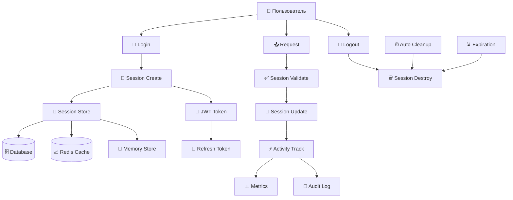

# ⏰ Урок 9: Управление сессиями

## 🎯 Продвинутое управление пользовательскими сессиями

В этом уроке изучим управление сессиями пользователей: создание, валидация, обновление, завершение и мониторинг активных сессий.

## 📊 Архитектура сессий



## 🏗️ Система управления сессиями

### sessionManager.js:

```javascript
// src/services/sessionManager.js

const crypto = require('crypto');
const jwt = require('jsonwebtoken');
const Redis = require('redis');
const { User } = require('../models');

class SessionManager {
  constructor() {
    this.sessions = new Map(); // In-memory fallback
    this.setupRedis();
    this.setupCleanup();
  }

  // Настройка Redis для хранения сессий
  async setupRedis() {
    try {
      this.redis = Redis.createClient({
        url: process.env.REDIS_URL || 'redis://localhost:6379',
        retry_strategy: (options) => {
          if (options.error && options.error.code === 'ECONNREFUSED') {
            console.error('Redis server отказал в подключении');
            return undefined;
          }
          if (options.total_retry_time > 1000 * 60 * 60) {
            console.error('Превышено время переподключения к Redis');
            return undefined;
          }
          if (options.attempt > 10) {
            console.error('Превышено количество попыток подключения к Redis');
            return undefined;
          }
          return Math.min(options.attempt * 100, 3000);
        }
      });

      await this.redis.connect();
      console.log('✅ Redis подключен для управления сессиями');
    } catch (error) {
      console.warn('⚠️ Redis недоступен, используется memory store:', error.message);
      this.redis = null;
    }
  }

  // Автоматическая очистка истекших сессий
  setupCleanup() {
    // Очистка каждые 15 минут
    setInterval(async () => {
      await this.cleanupExpiredSessions();
    }, 15 * 60 * 1000);

    // Очистка при завершении процесса
    process.on('SIGTERM', async () => {
      await this.destroyAllSessions();
    });
  }

  // Создание новой сессии
  async createSession(userId, deviceInfo = {}, options = {}) {
    try {
      const sessionId = this.generateSessionId();
      const now = new Date();
      
      const sessionData = {
        sessionId: sessionId,
        userId: userId,
        createdAt: now.toISOString(),
        lastActivity: now.toISOString(),
        expiresAt: new Date(now.getTime() + (options.maxAge || 24 * 60 * 60 * 1000)).toISOString(), // 24 часа по умолчанию
        device: {
          userAgent: deviceInfo.userAgent || '',
          ip: deviceInfo.ip || '',
          fingerprint: deviceInfo.fingerprint || '',
          platform: deviceInfo.platform || '',
          browser: deviceInfo.browser || ''
        },
        security: {
          isActive: true,
          loginAttempts: 0,
          lastLoginAt: now.toISOString(),
          riskScore: this.calculateRiskScore(deviceInfo),
          flags: []
        },
        permissions: options.permissions || [],
        metadata: options.metadata || {}
      };

      // Сохраняем сессию
      await this.saveSession(sessionId, sessionData);

      // Создаем JWT токен
      const jwtToken = this.createJWTToken(sessionData);

      // Создаем refresh token
      const refreshToken = await this.createRefreshToken(sessionId, userId);

      // Логируем создание сессии
      await this.logSessionEvent(sessionId, 'SESSION_CREATED', {
        userId: userId,
        device: deviceInfo
      });

      return {
        sessionId: sessionId,
        accessToken: jwtToken,
        refreshToken: refreshToken,
        expiresAt: sessionData.expiresAt,
        device: sessionData.device
      };

    } catch (error) {
      console.error('Ошибка создания сессии:', error);
      throw new Error('Не удалось создать сессию');
    }
  }

  // Генерация уникального ID сессии
  generateSessionId() {
    const timestamp = Date.now().toString(36);
    const randomBytes = crypto.randomBytes(16).toString('hex');
    return `sess_${timestamp}_${randomBytes}`;
  }

  // Расчет уровня риска
  calculateRiskScore(deviceInfo) {
    let score = 0;

    // Новое устройство
    if (!deviceInfo.isKnownDevice) score += 30;

    // Подозрительный User-Agent
    if (this.isSuspiciousUserAgent(deviceInfo.userAgent)) score += 20;

    // VPN/Proxy
    if (deviceInfo.isVPN) score += 25;

    // Необычная геолокация
    if (deviceInfo.unusualLocation) score += 15;

    // Время входа (ночные часы)
    const hour = new Date().getHours();
    if (hour >= 0 && hour <= 5) score += 10;

    return Math.min(score, 100);
  }

  // Проверка подозрительного User-Agent
  isSuspiciousUserAgent(userAgent) {
    if (!userAgent) return true;
    
    const suspiciousPatterns = [
      /bot/i, /crawler/i, /spider/i, /scraper/i,
      /headless/i, /phantom/i, /selenium/i
    ];
    
    return suspiciousPatterns.some(pattern => pattern.test(userAgent));
  }

  // Создание JWT токена
  createJWTToken(sessionData) {
    const payload = {
      sessionId: sessionData.sessionId,
      userId: sessionData.userId,
      iat: Math.floor(Date.now() / 1000),
      exp: Math.floor(new Date(sessionData.expiresAt).getTime() / 1000)
    };

    return jwt.sign(payload, process.env.JWT_SECRET, {
      algorithm: 'HS256'
    });
  }

  // Создание refresh token
  async createRefreshToken(sessionId, userId) {
    const refreshToken = crypto.randomBytes(32).toString('hex');
    const expiresAt = new Date(Date.now() + 30 * 24 * 60 * 60 * 1000); // 30 дней

    const refreshData = {
      token: refreshToken,
      sessionId: sessionId,
      userId: userId,
      createdAt: new Date().toISOString(),
      expiresAt: expiresAt.toISOString(),
      isUsed: false
    };

    // Сохраняем refresh token
    await this.saveRefreshToken(refreshToken, refreshData);

    return refreshToken;
  }

  // Сохранение сессии
  async saveSession(sessionId, sessionData) {
    try {
      if (this.redis) {
        const ttl = Math.floor((new Date(sessionData.expiresAt) - Date.now()) / 1000);
        await this.redis.setEx(`session:${sessionId}`, ttl, JSON.stringify(sessionData));
      } else {
        this.sessions.set(sessionId, sessionData);
      }
    } catch (error) {
      console.error('Ошибка сохранения сессии:', error);
      throw error;
    }
  }

  // Получение сессии
  async getSession(sessionId) {
    try {
      if (this.redis) {
        const data = await this.redis.get(`session:${sessionId}`);
        return data ? JSON.parse(data) : null;
      } else {
        return this.sessions.get(sessionId) || null;
      }
    } catch (error) {
      console.error('Ошибка получения сессии:', error);
      return null;
    }
  }

  // Валидация сессии
  async validateSession(sessionId, request = {}) {
    try {
      const sessionData = await this.getSession(sessionId);
      
      if (!sessionData) {
        return { valid: false, reason: 'SESSION_NOT_FOUND' };
      }

      // Проверка активности
      if (!sessionData.security.isActive) {
        return { valid: false, reason: 'SESSION_INACTIVE' };
      }

      // Проверка истечения
      if (new Date() > new Date(sessionData.expiresAt)) {
        await this.destroySession(sessionId);
        return { valid: false, reason: 'SESSION_EXPIRED' };
      }

      // Проверка устройства (опционально)
      if (request.deviceFingerprint && 
          sessionData.device.fingerprint && 
          request.deviceFingerprint !== sessionData.device.fingerprint) {
        
        await this.flagSession(sessionId, 'DEVICE_MISMATCH');
        
        // В зависимости от политики безопасности
        if (sessionData.security.riskScore > 50) {
          return { valid: false, reason: 'DEVICE_MISMATCH' };
        }
      }

      // Проверка IP (если включена строгая проверка)
      if (process.env.STRICT_IP_CHECK === 'true' && 
          request.ip && 
          sessionData.device.ip !== request.ip) {
        
        await this.flagSession(sessionId, 'IP_CHANGE');
        
        if (sessionData.security.riskScore > 70) {
          return { valid: false, reason: 'IP_MISMATCH' };
        }
      }

      // Обновляем активность
      await this.updateSessionActivity(sessionId, request);

      return { 
        valid: true, 
        session: sessionData,
        riskScore: sessionData.security.riskScore
      };

    } catch (error) {
      console.error('Ошибка валидации сессии:', error);
      return { valid: false, reason: 'VALIDATION_ERROR' };
    }
  }

  // Обновление активности сессии
  async updateSessionActivity(sessionId, request = {}) {
    try {
      const sessionData = await this.getSession(sessionId);
      if (!sessionData) return false;

      // Обновляем время последней активности
      sessionData.lastActivity = new Date().toISOString();

      // Обновляем метрики активности
      if (!sessionData.metrics) sessionData.metrics = {};
      sessionData.metrics.requestCount = (sessionData.metrics.requestCount || 0) + 1;
      sessionData.metrics.lastEndpoint = request.endpoint || '';
      sessionData.metrics.lastUserAgent = request.userAgent || '';

      // Продляем сессию при активности (опционально)
      if (process.env.EXTEND_SESSION_ON_ACTIVITY === 'true') {
        const newExpiration = new Date(Date.now() + 24 * 60 * 60 * 1000);
        sessionData.expiresAt = newExpiration.toISOString();
      }

      await this.saveSession(sessionId, sessionData);
      return true;

    } catch (error) {
      console.error('Ошибка обновления активности сессии:', error);
      return false;
    }
  }

  // Пометка сессии флагом
  async flagSession(sessionId, flag) {
    try {
      const sessionData = await this.getSession(sessionId);
      if (!sessionData) return false;

      if (!sessionData.security.flags.includes(flag)) {
        sessionData.security.flags.push(flag);
        
        // Увеличиваем risk score
        switch (flag) {
          case 'DEVICE_MISMATCH':
            sessionData.security.riskScore += 25;
            break;
          case 'IP_CHANGE':
            sessionData.security.riskScore += 15;
            break;
          case 'SUSPICIOUS_ACTIVITY':
            sessionData.security.riskScore += 30;
            break;
        }

        sessionData.security.riskScore = Math.min(sessionData.security.riskScore, 100);
        
        await this.saveSession(sessionId, sessionData);
        
        // Логируем событие
        await this.logSessionEvent(sessionId, 'SESSION_FLAGGED', { flag });
      }

      return true;
    } catch (error) {
      console.error('Ошибка пометки сессии:', error);
      return false;
    }
  }

  // Обновление токена
  async refreshToken(refreshToken) {
    try {
      const refreshData = await this.getRefreshToken(refreshToken);
      
      if (!refreshData) {
        return { success: false, reason: 'INVALID_REFRESH_TOKEN' };
      }

      if (refreshData.isUsed) {
        return { success: false, reason: 'REFRESH_TOKEN_ALREADY_USED' };
      }

      if (new Date() > new Date(refreshData.expiresAt)) {
        await this.destroyRefreshToken(refreshToken);
        return { success: false, reason: 'REFRESH_TOKEN_EXPIRED' };
      }

      // Получаем сессию
      const sessionData = await this.getSession(refreshData.sessionId);
      if (!sessionData) {
        return { success: false, reason: 'SESSION_NOT_FOUND' };
      }

      // Помечаем старый refresh token как использованный
      refreshData.isUsed = true;
      refreshData.usedAt = new Date().toISOString();
      await this.saveRefreshToken(refreshToken, refreshData);

      // Создаем новые токены
      const newJwtToken = this.createJWTToken(sessionData);
      const newRefreshToken = await this.createRefreshToken(refreshData.sessionId, refreshData.userId);

      // Обновляем активность сессии
      await this.updateSessionActivity(refreshData.sessionId);

      // Логируем обновление
      await this.logSessionEvent(refreshData.sessionId, 'TOKEN_REFRESHED');

      return {
        success: true,
        accessToken: newJwtToken,
        refreshToken: newRefreshToken,
        expiresAt: sessionData.expiresAt
      };

    } catch (error) {
      console.error('Ошибка обновления токена:', error);
      return { success: false, reason: 'REFRESH_ERROR' };
    }
  }

  // Завершение сессии
  async destroySession(sessionId, reason = 'LOGOUT') {
    try {
      const sessionData = await this.getSession(sessionId);
      
      if (sessionData) {
        // Логируем завершение сессии
        await this.logSessionEvent(sessionId, 'SESSION_DESTROYED', { reason });

        // Удаляем все связанные refresh tokens
        await this.destroyUserRefreshTokens(sessionData.userId, sessionId);
      }

      // Удаляем сессию
      if (this.redis) {
        await this.redis.del(`session:${sessionId}`);
      } else {
        this.sessions.delete(sessionId);
      }

      return true;
    } catch (error) {
      console.error('Ошибка завершения сессии:', error);
      return false;
    }
  }

  // Завершение всех сессий пользователя
  async destroyUserSessions(userId, exceptSessionId = null) {
    try {
      const userSessions = await this.getUserSessions(userId);
      
      for (const session of userSessions) {
        if (session.sessionId !== exceptSessionId) {
          await this.destroySession(session.sessionId, 'ALL_SESSIONS_LOGOUT');
        }
      }

      return true;
    } catch (error) {
      console.error('Ошибка завершения сессий пользователя:', error);
      return false;
    }
  }

  // Получение всех сессий пользователя
  async getUserSessions(userId) {
    try {
      const sessions = [];

      if (this.redis) {
        const keys = await this.redis.keys('session:*');
        for (const key of keys) {
          const data = await this.redis.get(key);
          if (data) {
            const sessionData = JSON.parse(data);
            if (sessionData.userId === userId) {
              sessions.push(sessionData);
            }
          }
        }
      } else {
        for (const [sessionId, sessionData] of this.sessions.entries()) {
          if (sessionData.userId === userId) {
            sessions.push(sessionData);
          }
        }
      }

      return sessions;
    } catch (error) {
      console.error('Ошибка получения сессий пользователя:', error);
      return [];
    }
  }

  // Сохранение refresh token
  async saveRefreshToken(token, data) {
    try {
      if (this.redis) {
        const ttl = Math.floor((new Date(data.expiresAt) - Date.now()) / 1000);
        await this.redis.setEx(`refresh:${token}`, ttl, JSON.stringify(data));
      }
    } catch (error) {
      console.error('Ошибка сохранения refresh token:', error);
    }
  }

  // Получение refresh token
  async getRefreshToken(token) {
    try {
      if (this.redis) {
        const data = await this.redis.get(`refresh:${token}`);
        return data ? JSON.parse(data) : null;
      }
      return null;
    } catch (error) {
      console.error('Ошибка получения refresh token:', error);
      return null;
    }
  }

  // Удаление refresh token
  async destroyRefreshToken(token) {
    try {
      if (this.redis) {
        await this.redis.del(`refresh:${token}`);
      }
    } catch (error) {
      console.error('Ошибка удаления refresh token:', error);
    }
  }

  // Удаление всех refresh tokens пользователя
  async destroyUserRefreshTokens(userId, sessionId = null) {
    try {
      if (this.redis) {
        const keys = await this.redis.keys('refresh:*');
        for (const key of keys) {
          const data = await this.redis.get(key);
          if (data) {
            const refreshData = JSON.parse(data);
            if (refreshData.userId === userId && 
                (!sessionId || refreshData.sessionId === sessionId)) {
              await this.redis.del(key);
            }
          }
        }
      }
    } catch (error) {
      console.error('Ошибка удаления refresh tokens пользователя:', error);
    }
  }

  // Очистка истекших сессий
  async cleanupExpiredSessions() {
    try {
      let cleanedCount = 0;

      if (this.redis) {
        const keys = await this.redis.keys('session:*');
        for (const key of keys) {
          const ttl = await this.redis.ttl(key);
          if (ttl <= 0) {
            await this.redis.del(key);
            cleanedCount++;
          }
        }
      } else {
        const now = new Date();
        for (const [sessionId, sessionData] of this.sessions.entries()) {
          if (now > new Date(sessionData.expiresAt)) {
            this.sessions.delete(sessionId);
            cleanedCount++;
          }
        }
      }

      if (cleanedCount > 0) {
        console.log(`🧹 Очищено ${cleanedCount} истекших сессий`);
      }

      return cleanedCount;
    } catch (error) {
      console.error('Ошибка очистки истекших сессий:', error);
      return 0;
    }
  }

  // Логирование событий сессии
  async logSessionEvent(sessionId, eventType, details = {}) {
    try {
      const logEntry = {
        sessionId: sessionId,
        eventType: eventType,
        timestamp: new Date().toISOString(),
        details: details
      };

      // Логируем в консоль
      console.log('📝 Session Event:', logEntry);

      // Можно добавить сохранение в базу данных
      // await SessionLog.create(logEntry);

    } catch (error) {
      console.error('Ошибка логирования события сессии:', error);
    }
  }

  // Завершение всех сессий (при выключении сервера)
  async destroyAllSessions() {
    try {
      if (this.redis) {
        const sessionKeys = await this.redis.keys('session:*');
        const refreshKeys = await this.redis.keys('refresh:*');
        
        if (sessionKeys.length > 0) {
          await this.redis.del(...sessionKeys);
        }
        
        if (refreshKeys.length > 0) {
          await this.redis.del(...refreshKeys);
        }
        
        console.log(`🧹 Завершено ${sessionKeys.length} сессий при выключении`);
      } else {
        this.sessions.clear();
      }
    } catch (error) {
      console.error('Ошибка завершения всех сессий:', error);
    }
  }

  // Получение статистики сессий
  async getSessionStats() {
    try {
      const stats = {
        totalSessions: 0,
        activeSessions: 0,
        expiredSessions: 0,
        flaggedSessions: 0,
        userDistribution: {},
        deviceDistribution: {},
        riskDistribution: { low: 0, medium: 0, high: 0 }
      };

      const sessions = [];

      if (this.redis) {
        const keys = await this.redis.keys('session:*');
        for (const key of keys) {
          const data = await this.redis.get(key);
          if (data) {
            sessions.push(JSON.parse(data));
          }
        }
      } else {
        sessions.push(...this.sessions.values());
      }

      stats.totalSessions = sessions.length;
      const now = new Date();

      for (const session of sessions) {
        // Активные/истекшие
        if (new Date(session.expiresAt) > now && session.security.isActive) {
          stats.activeSessions++;
        } else {
          stats.expiredSessions++;
        }

        // Помеченные флагами
        if (session.security.flags.length > 0) {
          stats.flaggedSessions++;
        }

        // Распределение по пользователям
        stats.userDistribution[session.userId] = 
          (stats.userDistribution[session.userId] || 0) + 1;

        // Распределение по платформам
        const platform = session.device.platform || 'unknown';
        stats.deviceDistribution[platform] = 
          (stats.deviceDistribution[platform] || 0) + 1;

        // Распределение по уровню риска
        const riskScore = session.security.riskScore || 0;
        if (riskScore < 30) {
          stats.riskDistribution.low++;
        } else if (riskScore < 70) {
          stats.riskDistribution.medium++;
        } else {
          stats.riskDistribution.high++;
        }
      }

      return stats;
    } catch (error) {
      console.error('Ошибка получения статистики сессий:', error);
      return null;
    }
  }
}

module.exports = SessionManager;
```

## 🎮 Middleware для управления сессиями

### sessionMiddleware.js:

```javascript
// src/middleware/sessionMiddleware.js

const SessionManager = require('../services/sessionManager');

class SessionMiddleware {
  constructor() {
    this.sessionManager = new SessionManager();
  }

  // Middleware для проверки сессии
  validateSession() {
    return async (req, res, next) => {
      try {
        // Получаем токен из заголовков
        const authHeader = req.headers.authorization;
        if (!authHeader || !authHeader.startsWith('Bearer ')) {
          return res.status(401).json({
            success: false,
            message: 'Токен доступа не предоставлен',
            code: 'NO_TOKEN'
          });
        }

        const token = authHeader.slice(7);
        
        // Декодируем JWT
        const jwt = require('jsonwebtoken');
        const decoded = jwt.verify(token, process.env.JWT_SECRET);
        
        // Валидируем сессию
        const validation = await this.sessionManager.validateSession(decoded.sessionId, {
          ip: req.ip,
          userAgent: req.headers['user-agent'],
          endpoint: req.originalUrl,
          deviceFingerprint: req.headers['x-device-fingerprint']
        });

        if (!validation.valid) {
          return res.status(401).json({
            success: false,
            message: 'Недействительная сессия',
            code: validation.reason
          });
        }

        // Добавляем данные сессии в request
        req.session = validation.session;
        req.user = { userId: validation.session.userId };
        req.riskScore = validation.riskScore;

        next();

      } catch (error) {
        if (error.name === 'TokenExpiredError') {
          return res.status(401).json({
            success: false,
            message: 'Токен истек',
            code: 'TOKEN_EXPIRED'
          });
        }

        console.error('Ошибка валидации сессии:', error);
        return res.status(401).json({
          success: false,
          message: 'Ошибка проверки сессии',
          code: 'SESSION_ERROR'
        });
      }
    };
  }

  // Middleware для проверки уровня риска
  requireLowRisk() {
    return (req, res, next) => {
      if (req.riskScore > 70) {
        return res.status(403).json({
          success: false,
          message: 'Высокий уровень риска. Требуется дополнительная верификация',
          code: 'HIGH_RISK_SESSION',
          riskScore: req.riskScore
        });
      }
      next();
    };
  }

  // Middleware для ограничения одновременных сессий
  limitConcurrentSessions(maxSessions = 5) {
    return async (req, res, next) => {
      try {
        const userId = req.user.userId;
        const userSessions = await this.sessionManager.getUserSessions(userId);
        
        if (userSessions.length > maxSessions) {
          // Завершаем самые старые сессии
          const sortedSessions = userSessions.sort((a, b) => 
            new Date(a.lastActivity) - new Date(b.lastActivity)
          );
          
          const sessionsToRemove = sortedSessions.slice(0, userSessions.length - maxSessions);
          
          for (const session of sessionsToRemove) {
            await this.sessionManager.destroySession(session.sessionId, 'MAX_SESSIONS_EXCEEDED');
          }
        }
        
        next();
      } catch (error) {
        console.error('Ошибка ограничения сессий:', error);
        next();
      }
    };
  }

  // Middleware для логирования активности сессии
  logActivity() {
    return async (req, res, next) => {
      try {
        if (req.session) {
          const activity = {
            endpoint: req.originalUrl,
            method: req.method,
            userAgent: req.headers['user-agent'],
            ip: req.ip,
            timestamp: new Date().toISOString()
          };

          // Логируем подозрительную активность
          if (this.isSuspiciousActivity(activity, req.session)) {
            await this.sessionManager.flagSession(req.session.sessionId, 'SUSPICIOUS_ACTIVITY');
          }
        }
        
        next();
      } catch (error) {
        console.error('Ошибка логирования активности:', error);
        next();
      }
    };
  }

  // Проверка подозрительной активности
  isSuspiciousActivity(activity, session) {
    // Слишком много запросов в короткое время
    const recentRequests = session.metrics?.requestCount || 0;
    if (recentRequests > 100) { // За сессию
      return true;
    }

    // Подозрительные эндпоинты
    const suspiciousEndpoints = ['/admin/', '/api/users/', '/api/system/'];
    if (suspiciousEndpoints.some(endpoint => activity.endpoint.includes(endpoint))) {
      const userRoles = session.permissions || [];
      if (!userRoles.includes('admin')) {
        return true;
      }
    }

    // Смена User-Agent в рамках сессии
    if (session.device.userAgent !== activity.userAgent) {
      return true;
    }

    return false;
  }

  // Обновление токена
  refreshToken() {
    return async (req, res, next) => {
      try {
        const { refreshToken } = req.body;
        
        if (!refreshToken) {
          return res.status(400).json({
            success: false,
            message: 'Refresh token не предоставлен',
            code: 'NO_REFRESH_TOKEN'
          });
        }

        const result = await this.sessionManager.refreshToken(refreshToken);
        
        if (!result.success) {
          return res.status(401).json({
            success: false,
            message: 'Не удалось обновить токен',
            code: result.reason
          });
        }

        res.json({
          success: true,
          token: result.accessToken,
          refreshToken: result.refreshToken,
          expiresAt: result.expiresAt
        });

      } catch (error) {
        console.error('Ошибка обновления токена:', error);
        res.status(500).json({
          success: false,
          message: 'Ошибка обновления токена',
          code: 'REFRESH_ERROR'
        });
      }
    };
  }

  // Завершение сессии
  logout() {
    return async (req, res, next) => {
      try {
        const sessionId = req.session?.sessionId;
        
        if (sessionId) {
          await this.sessionManager.destroySession(sessionId, 'USER_LOGOUT');
        }

        res.json({
          success: true,
          message: 'Сессия завершена'
        });

      } catch (error) {
        console.error('Ошибка завершения сессии:', error);
        res.status(500).json({
          success: false,
          message: 'Ошибка завершения сессии',
          code: 'LOGOUT_ERROR'
        });
      }
    };
  }

  // Завершение всех сессий пользователя
  logoutAll() {
    return async (req, res, next) => {
      try {
        const userId = req.user.userId;
        const currentSessionId = req.session?.sessionId;
        
        await this.sessionManager.destroyUserSessions(userId, currentSessionId);

        res.json({
          success: true,
          message: 'Все сессии завершены'
        });

      } catch (error) {
        console.error('Ошибка завершения всех сессий:', error);
        res.status(500).json({
          success: false,
          message: 'Ошибка завершения сессий',
          code: 'LOGOUT_ALL_ERROR'
        });
      }
    };
  }

  // Получение информации о сессиях
  getSessionInfo() {
    return async (req, res, next) => {
      try {
        const userId = req.user.userId;
        const sessions = await this.sessionManager.getUserSessions(userId);
        
        // Форматируем данные для клиента
        const sessionInfo = sessions.map(session => ({
          sessionId: session.sessionId,
          createdAt: session.createdAt,
          lastActivity: session.lastActivity,
          device: {
            platform: session.device.platform,
            browser: session.device.browser,
            ip: session.device.ip
          },
          isCurrent: session.sessionId === req.session.sessionId,
          riskScore: session.security.riskScore,
          flags: session.security.flags
        }));

        res.json({
          success: true,
          sessions: sessionInfo
        });

      } catch (error) {
        console.error('Ошибка получения информации о сессиях:', error);
        res.status(500).json({
          success: false,
          message: 'Ошибка получения информации о сессиях',
          code: 'SESSION_INFO_ERROR'
        });
      }
    };
  }
}

module.exports = SessionMiddleware;
```

## 🎮 Клиентское управление сессиями

### sessionClient.js:

```javascript
// public/scripts/session-client.js

class SessionClient {
  constructor() {
    this.setupSessionMonitoring();
    this.setupActivityTracking();
    this.setupBeforeUnload();
  }

  // Мониторинг сессии
  setupSessionMonitoring() {
    // Проверяем сессию каждые 5 минут
    setInterval(() => {
      this.checkSessionHealth();
    }, 5 * 60 * 1000);

    // Проверяем при восстановлении соединения
    window.addEventListener('online', () => {
      this.checkSessionHealth();
    });

    // Проверяем при фокусе на окне
    window.addEventListener('focus', () => {
      this.checkSessionHealth();
    });
  }

  // Отслеживание активности пользователя
  setupActivityTracking() {
    const events = ['click', 'keypress', 'scroll', 'mousemove'];
    let lastActivity = Date.now();
    let inactivityTimer = null;

    const updateActivity = () => {
      lastActivity = Date.now();
      
      // Сбрасываем таймер неактивности
      if (inactivityTimer) {
        clearTimeout(inactivityTimer);
      }

      // Устанавливаем таймер на 30 минут неактивности
      inactivityTimer = setTimeout(() => {
        this.handleInactivity();
      }, 30 * 60 * 1000);
    };

    events.forEach(event => {
      document.addEventListener(event, updateActivity, { passive: true });
    });

    // Инициализируем таймер
    updateActivity();
  }

  // Обработка перед закрытием страницы
  setupBeforeUnload() {
    window.addEventListener('beforeunload', (event) => {
      // Сохраняем состояние сессии
      this.saveSessionState();
      
      // Отправляем beacon для логирования
      if (navigator.sendBeacon) {
        const data = JSON.stringify({
          action: 'page_unload',
          timestamp: Date.now(),
          sessionId: this.getSessionId()
        });
        
        navigator.sendBeacon('/api/auth/session-activity', data);
      }
    });
  }

  // Проверка состояния сессии
  async checkSessionHealth() {
    try {
      const token = Auth.getToken();
      if (!token) return;

      const response = await fetch('/api/auth/session-check', {
        method: 'GET',
        headers: {
          'Authorization': `Bearer ${token}`,
          'X-Device-Fingerprint': this.getDeviceFingerprint()
        }
      });

      if (response.status === 401) {
        // Токен истек, пытаемся обновить
        const refreshed = await this.refreshSession();
        if (!refreshed) {
          this.handleSessionExpired();
        }
      } else if (response.status === 403) {
        // Высокий уровень риска
        const data = await response.json();
        this.handleHighRiskSession(data);
      } else if (response.ok) {
        const data = await response.json();
        this.updateSessionInfo(data);
      }

    } catch (error) {
      console.error('Ошибка проверки сессии:', error);
    }
  }

  // Обновление сессии
  async refreshSession() {
    try {
      const refreshToken = localStorage.getItem('refreshToken');
      if (!refreshToken) return false;

      const response = await fetch('/api/auth/refresh', {
        method: 'POST',
        headers: {
          'Content-Type': 'application/json'
        },
        body: JSON.stringify({ refreshToken })
      });

      if (response.ok) {
        const data = await response.json();
        Auth.saveToken(data.token);
        localStorage.setItem('refreshToken', data.refreshToken);
        
        console.log('🔄 Сессия обновлена');
        return true;
      }

      return false;
    } catch (error) {
      console.error('Ошибка обновления сессии:', error);
      return false;
    }
  }

  // Обработка истечения сессии
  handleSessionExpired() {
    Notifications.warning('Ваша сессия истекла. Требуется повторный вход.');
    
    // Очищаем данные
    Auth.logout();
    
    // Перенаправляем на страницу входа
    setTimeout(() => {
      window.location.href = '/login.html?session=expired';
    }, 2000);
  }

  // Обработка сессии с высоким риском
  handleHighRiskSession(data) {
    const message = `Обнаружена подозрительная активность. Уровень риска: ${data.riskScore}`;
    
    if (data.riskScore > 90) {
      // Критический уровень - принудительный выход
      Notifications.error('Критический уровень риска. Сессия завершена.');
      Auth.logout();
      window.location.href = '/login.html?risk=high';
    } else {
      // Предупреждение
      Notifications.warning(message);
      
      // Предлагаем дополнительную верификацию
      this.offerAdditionalVerification();
    }
  }

  // Предложение дополнительной верификации
  offerAdditionalVerification() {
    const verify = confirm(
      'Для обеспечения безопасности рекомендуется пройти дополнительную верификацию. Продолжить?'
    );
    
    if (verify) {
      window.location.href = '/verify.html';
    }
  }

  // Обработка неактивности
  handleInactivity() {
    const modal = document.createElement('div');
    modal.className = 'inactivity-modal';
    modal.innerHTML = `
      <div class="modal-content">
        <h3>⏰ Длительная неактивность</h3>
        <p>Ваша сессия будет завершена через <span id="countdown">60</span> секунд из-за неактивности.</p>
        <div class="modal-actions">
          <button id="extend-session" class="btn btn-primary">Продлить сессию</button>
          <button id="logout-now" class="btn btn-secondary">Завершить сейчас</button>
        </div>
      </div>
    `;

    document.body.appendChild(modal);

    // Обработчики кнопок
    document.getElementById('extend-session').onclick = () => {
      this.extendSession();
      document.body.removeChild(modal);
    };

    document.getElementById('logout-now').onclick = () => {
      Auth.logout();
      window.location.href = '/login.html';
    };

    // Обратный отсчет
    let countdown = 60;
    const countdownElement = document.getElementById('countdown');
    
    const timer = setInterval(() => {
      countdown--;
      countdownElement.textContent = countdown;
      
      if (countdown <= 0) {
        clearInterval(timer);
        Auth.logout();
        window.location.href = '/login.html?reason=inactivity';
      }
    }, 1000);

    // Автоматическое удаление модала через 60 секунд
    setTimeout(() => {
      if (modal.parentNode) {
        clearInterval(timer);
        document.body.removeChild(modal);
      }
    }, 60000);
  }

  // Продление сессии
  async extendSession() {
    try {
      const token = Auth.getToken();
      const response = await fetch('/api/auth/extend-session', {
        method: 'POST',
        headers: {
          'Authorization': `Bearer ${token}`,
          'Content-Type': 'application/json'
        }
      });

      if (response.ok) {
        Notifications.success('Сессия продлена');
        return true;
      } else {
        throw new Error('Не удалось продлить сессию');
      }
    } catch (error) {
      console.error('Ошибка продления сессии:', error);
      Notifications.error('Не удалось продлить сессию');
      return false;
    }
  }

  // Получение информации о сессиях
  async getSessionInfo() {
    try {
      const token = Auth.getToken();
      const response = await fetch('/api/auth/sessions', {
        method: 'GET',
        headers: {
          'Authorization': `Bearer ${token}`
        }
      });

      if (response.ok) {
        return await response.json();
      }
      
      throw new Error('Не удалось получить информацию о сессиях');
    } catch (error) {
      console.error('Ошибка получения информации о сессиях:', error);
      return null;
    }
  }

  // Завершение конкретной сессии
  async terminateSession(sessionId) {
    try {
      const token = Auth.getToken();
      const response = await fetch(`/api/auth/sessions/${sessionId}`, {
        method: 'DELETE',
        headers: {
          'Authorization': `Bearer ${token}`
        }
      });

      if (response.ok) {
        Notifications.success('Сессия завершена');
        return true;
      }
      
      throw new Error('Не удалось завершить сессию');
    } catch (error) {
      console.error('Ошибка завершения сессии:', error);
      Notifications.error('Не удалось завершить сессию');
      return false;
    }
  }

  // Утилиты
  getDeviceFingerprint() {
    // Создаем отпечаток устройства
    const canvas = document.createElement('canvas');
    const ctx = canvas.getContext('2d');
    ctx.textBaseline = 'top';
    ctx.font = '14px Arial';
    ctx.fillText('Device fingerprint', 2, 2);

    return btoa(JSON.stringify({
      screen: `${screen.width}x${screen.height}`,
      timezone: Intl.DateTimeFormat().resolvedOptions().timeZone,
      language: navigator.language,
      platform: navigator.platform,
      canvas: canvas.toDataURL(),
      userAgent: navigator.userAgent.substring(0, 100)
    })).substring(0, 32);
  }

  getSessionId() {
    const token = Auth.getToken();
    if (!token) return null;

    try {
      const payload = JSON.parse(atob(token.split('.')[1]));
      return payload.sessionId;
    } catch {
      return null;
    }
  }

  saveSessionState() {
    const state = {
      timestamp: Date.now(),
      url: window.location.href,
      scrollPosition: window.scrollY
    };
    
    sessionStorage.setItem('sessionState', JSON.stringify(state));
  }

  updateSessionInfo(data) {
    // Обновляем информацию о сессии в интерфейсе
    const sessionInfo = document.getElementById('session-info');
    if (sessionInfo && data.session) {
      sessionInfo.innerHTML = `
        <div class="session-details">
          <span class="risk-score risk-${this.getRiskLevel(data.session.riskScore)}">
            Уровень риска: ${data.session.riskScore}
          </span>
          <span class="last-activity">
            Последняя активность: ${new Date(data.session.lastActivity).toLocaleString()}
          </span>
        </div>
      `;
    }
  }

  getRiskLevel(score) {
    if (score < 30) return 'low';
    if (score < 70) return 'medium';
    return 'high';
  }
}

// Инициализация при загрузке
document.addEventListener('DOMContentLoaded', function() {
  if (Auth.isAuthenticated()) {
    window.sessionClient = new SessionClient();
    console.log('📊 Session Client инициализирован');
  }
});

// Экспорт для модулей
if (typeof module !== 'undefined' && module.exports) {
  module.exports = SessionClient;
}
```

## 🧪 Практические задания

### Задание 1: Устройство-специфичные сессии

Реализуйте привязку сессий к конкретным устройствам.

### Задание 2: Сессии с географическими ограничениями

Добавьте проверку местоположения при валидации сессий.

### Задание 3: Адаптивное время жизни сессий

Создайте систему динамического продления сессий на основе активности.

### Задание 4: Дашборд управления сессиями

Разработайте интерфейс для просмотра и управления активными сессиями.

---

**Следующий урок:** [Урок 10: Практические примеры](10_PRACTICAL_EXAMPLES.md) 🛠️

**Практика:** Протестируйте различные сценарии управления сессиями!